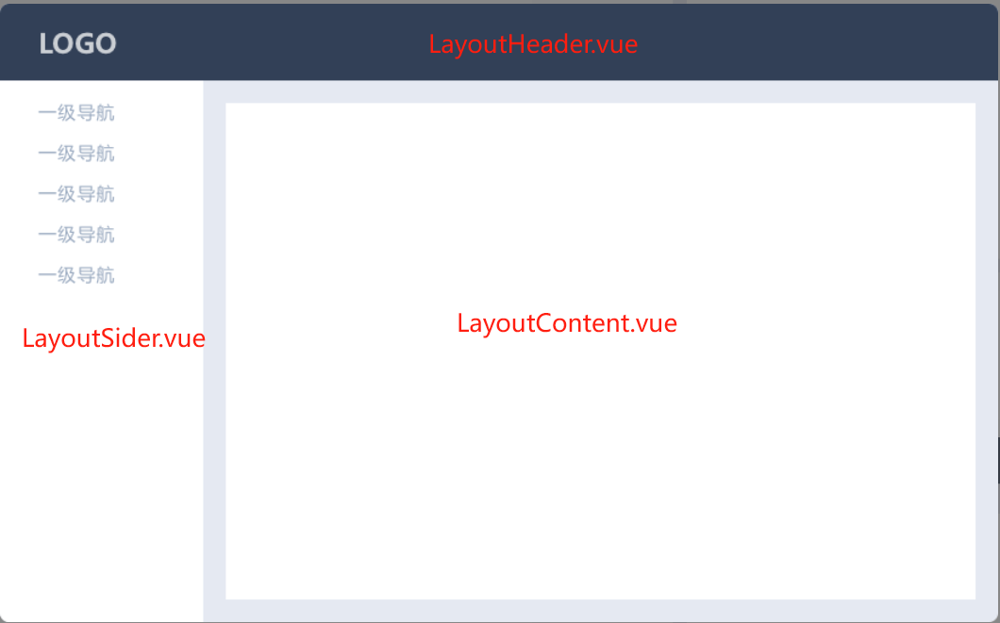

# 组件化

## 是什么？

- 一个页面往往是由一个一个的功能区域组合而成。而一个功能区域，就可以是一个组件，
  - 例如头部组件 LayoutHeader, 侧边栏组件 LayoutSider, 主内容组件 LayoutContent。他们是布局类组件，共同组合，形成一个页面的布局，使 vue 文件的 template 结构清晰。如图。



- 下面的 vue 布局页面是不是很清晰呢~~~

```vue
<template>
  <div class="app">
    // 头部
    <LayoutHeader></LayoutHeader>
    <section class="app-body">
      // 侧边栏
      <LayoutSider></LayoutSider>
      // 主内容区
      <LayoutContent></LayoutContent>
    </section>
  </div>
</template>
```

## 解决什么问题？

1. 复用：复用功能块。

- 例如弹窗组件，很多地方要用，不可能每个页面 ctrl+c,ctrl+v 写一大堆弹窗的 html，js, css, img。封装起来，通过插槽 slot 传入内容，就省了很多代码量和心智负担。

2. 结构清晰，一目了然：

- 如果没有组件化，那么一个 vue 页面的代码，是由所有的功能代码堆积而成的，几千几万行代码，要找某个代码，简直眼花缭乱，大海捞针。
- 而组件化之后。一个功能区域一个组件。一眼就能看到该页面有哪些功能组件，非常好找！要找哪个功能的代码，直接去到那个组件即可。

3. 好维护：一个组件，被大量复用，改一个，全改了，即使有个别特殊情况，也可通过 props 传参等方式做处理

- 若弹窗功能没有组件化，遇到产品需求改动，我要加几个图标，要加几个按钮...等等，能全局替换还好，要是不行，还得一个个改，工作量庞大，直接头大~~~
  - 有了组件化之后，直接改组件即可

4. 前端统一：前端成员都使用一种组件，那么大家的页面，都表现一致，形成统一。而不是五花八门。

5. 全局主题切换：可让组件引用:root 根样式，去支持 js 动态切换主题色等样式，

- ```css
  :root {
    --main-font-color: "#666";
    --headerHeight: 60px;
  }
  ```
- ```js
  // js动态改变
  document.documentElement.style.setProperty("--main-font-color", "#333");
  ```

6. 前端资产：一个项目中好的组件，可以抽离出来，给其他项目也使用，发布 npm 包，或 npm 私仓，或加到前端组件库中，作为公司或个人的积累，都是一笔好的前端资产
7. 提高团队和个人竞争力：提高个人组件封装能力、封装思想

## 封装单个组件

解决什么问题？

- 一个组件，需要复用，可抽离

## 封装组件库

是什么？

- 很多组件放一个库里，通过 esm 之 export/import 去按需引入组件，类似 element-ui, 可在其上二次封装一层，实现自己的组件库。

解决什么问题？

- 需要一系列的组件，统一的主题色，字体大小，间距等等

怎么做？

- 1.组件库代码: 基于 element-ui 二次封装
  - 先搭建框架，封装一个 card 组件看看
- 2.组件库文档: 基于 vitepress
  - 代码放在跟组件库一个目录吗？还是新创建个项目呢？github pages 只能一个主页哦
    - 所以，放两个项目吧？

### 基于 element-ui 源码二次开发

- 参考：https://docs.pingcode.com/ask/ask-ask/255880.html
- 参考：https://blog.51cto.com/u_12196/10164143

## 自定义组件

## 第三方组件二次封装

### element table 二次封装

### el-dialog 优雅实现

直接通过通过 ref 去调子组件方法，实现打开。关闭弹窗，以及获取信息接口，这样子组件的逻辑可全写在子组件，非常好开发和维护

- \<child-dialog ref="childRef" \/\>
- this.$refs['childRef'].openFun()
- this.$refs['childRef'].closeFun()

是不是贼方便，不用再维护一个变量 dialogVisible=true/false
而是把弹窗方法，完全交给弹窗组件自己，如打开和关闭方法

#### 分页多选 ->mixins 可实现

是什么？是表格 支持分页，也支持多选
难点？是切换页码后，从后台获取新数据，但之前勾选过该项，怎么回显勾选的问题

- 切页后，回显之前的选择项

### element form 二次封装

### uniapp upload 二次封装

## js-Api 方式组件封装

### 是什么？

通过 js 函数调用的方式，展示 vue 组件，如 msg 提示组件、confirm 确认弹窗等

### 解决什么问题？

- 设想一下，当我们提交表单或操作后，无论成功还是失败，都会弹窗消息提示框。
- 几乎每个页面都会有 message 弹窗，那我们要在每个页面写上\<message\>组件吗？会不会太多
- 解决办法：用 this.$customMsg 调函数形式使用： 通过把 message 组件单独做成 vue 实例，挂到 vue 上，再渲染到页面上。

### 怎么做？

- vue2:
  - ComponentVueChildClass = Vue.extend(vueComponent) => instance = new ComponentVueChildClass({data, methods, mounted(){}...}) => instance.$mount() => document.body.appendChild(instance.$el)
- vue3:
  - createVNode, render => instance = createVNode(vueComponent, {传入 props...}) => render(instance, document.getElementById('my-node'))
    https://blog.csdn.net/Lyrelion/article/details/128261995
