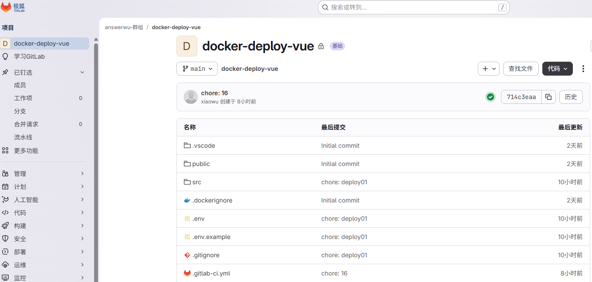
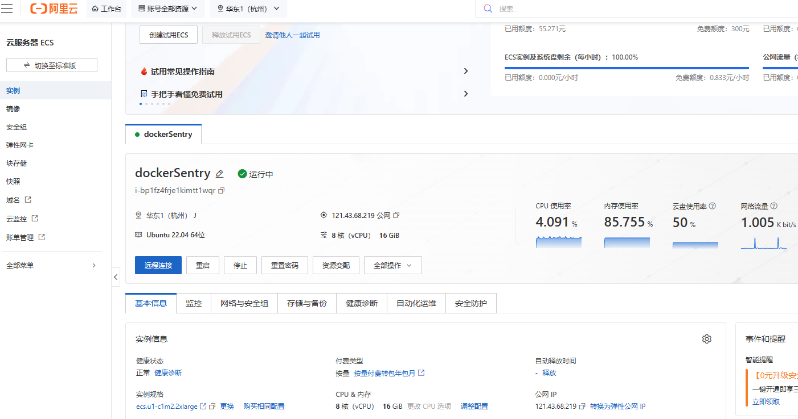
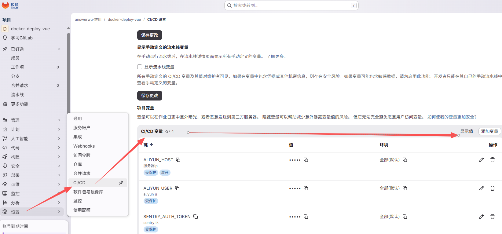

# devOps 开发运维自动化 & CI/CD 持续集成/持续部署

- 参考资料：https://blog.csdn.net/2401_83384536/article/details/140321988

## 是什么

- 是 development 和 Operations 的组合，是一个方法论。是重视 dev 开发人员和 Ops 运维人员的沟通、协作的流程。通过自动化的构建、测试、部署，来让流程变得快捷、稳定、可靠。
- CI: Continuous Integration，持续集成
- CD: Continuous Delivery，持续交付

## 为什么需要 devOps？
- 打破开发和运维合作中间的“墙”，从代码开发到部署上线，自动化高效执行，避免了很多运维部署隐患。

## 怎么做
- gitlab-ci 流水线: 当分支合并或 MR 合并请求时 触发流水线CI，自动执行lint、单元测试，通过后自动build，部署到云服务器
- docker 容器化部署：让代码构建打包在纯净的环境里进行，保证在不同系统上构建的环境的一致性，不受服务器终端影响；
- github actions 流水线：同gitlab-ci
- gitlab-ci + docker： 可以互相配合, 如分支合并自动触发流水线CI，执行docker build构建镜像，构建产物直接能push到镜像仓库，流水线CI登录云服务器，然后可直接拉取镜像，完成部署
- 规范化部署流程
- ...

## 解决什么问题？

- 传统发版方式一：前端手动打包dist给运维会造成很多隐患问题
  1. dist是否通过 lint + 单元测试 --不知道
  2. dist在windows下的node@20打包的，在linus上能否正常运行  --不知道
- gitlab-ci 能在每次打包部署前，自动校验lint、test、build等
- docker 解决构建打包环境的一致性
- docker build构建镜像 有版本可追溯，回滚容易


## 实战操作步骤（gitlab-ci + docker为例）
### 代码仓库gitlab（代码托管）

### gitlab自带镜像仓库/开通阿里云镜像仓库（镜像中转）
### 开通阿里云服务器（部署服务器）

### 根目录.npmrc，设置npm镜像加速pnpm install
```.npmrc
registry=https://registry.npmmirror.com
```
### 项目根目录编写pnpm-workspace.yaml 
- 解决docker环境@sentry/cli报错问题
```yaml
allowBuilds:
   "@sentry/cli": true
```
### 写Dockerfile（构建镜像）
```Dockerfile
# 一阶段 构建vue项目
FROM node:22-alpine AS build-stage
# 设置npm镜像
# RUN npm config set registry https://registry.npmmirror.com
WORKDIR /app
COPY package*.json pnpm-lock.yaml .npmrc pnpm-workspace.yaml ./
RUN npm install -g pnpm
RUN pnpm -v
# RUN pnpm config get registry
RUN pnpm install --frozen-lockfile
COPY . .
RUN pnpm build

# 二阶段 部署到容器的nginx中运行 对外暴露80端口 
FROM nginx:stable-alpine AS production-stage
COPY --from=build-stage /app/dist /usr/share/nginx/html
# 配置nginx.conf
COPY nginx.conf /etc/nginx/conf.d/default.conf
# 暴露80端口
EXPOSE 80
# 启动nginx容器 并暴露80端口 关闭守护进程 不占用宿命令行
CMD ["nginx", "-g", "daemon off;"]

```
### 设置gitlab环境变量

### 写gitlab-ci文件（写流水线）
```yaml
# 定义任务
stages:
  - build
  - deploy
# 定义变量
variables:
  DOCKER_IMAGE_NAME: $CI_REGISTRY_IMAGE:$CI_COMMIT_SHA
  CONTAINER_NAME: wu-vue-app
  HOST_PORT: 80
  CONTAINER_PORT: 80

# ===========公共配置：构建+推送==============
.docker-build-common:
  # Use the official docker image.
  image: docker:cli
  stage: build
  services:
  - name: docker:24-dind
    command:
      - "--registry-mirror=https://docker.m.daocloud.io"
  variables:
    DOCKER_TLS_CERTDIR: "/certs"
    DOCKER_HOST: "tcp://docker:2376"
    # $CI_COMMIT_REF_SLUG is the branch name and $CI_COMMIT_SHA is the commit sha
  before_script:
    - docker info | grep -A3 "Registry Mirrors"
    - docker login -u "$CI_REGISTRY_USER" -p "$CI_REGISTRY_PASSWORD" $CI_REGISTRY
  # All branches are tagged with $DOCKER_IMAGE_NAME (defaults to commit ref slug)
  # Default branch is also tagged with $branch_name
  script:
    - docker build --pull -t "$DOCKER_IMAGE_NAME" .
    - docker push "$DOCKER_IMAGE_NAME"
    - docker tag "$DOCKER_IMAGE_NAME" "$CI_REGISTRY_IMAGE:$branch_name"
    - docker push "$CI_REGISTRY_IMAGE:$branch_name"
  # Run this job in a branch where a Dockerfile exists
  # $CI_DEFAULT_BRANCH 默认是main
  rules:
    - exists:
        - Dockerfile

# ===========默认 main 分支：构建+推送==============
docker-build-main:
  extends: .docker-build-common
  variables:
    branch_name: "main"
  rules:
    - if: $CI_COMMIT_BRANCH == "main"
      exists:
        - Dockerfile

# ===========dev 分支：构建+推送==============
docker-build-dev:
  extends: .docker-build-common
  variables:
    branch_name: "dev"
  rules:
    - if: $CI_COMMIT_BRANCH == "dev"
      exists:
        - Dockerfile
# =========== release 部署到阿里云 ==============
deploy-to-aliyun:
  stage: deploy
  image: alpine:latest
  needs:
    - docker-build-main
  rules:
    - if: $CI_COMMIT_BRANCH == "main"
  before_script:
    - apk add --no-cache openssh-client
    - eval $(ssh-agent)
    - echo "$SSH_PRIVATE_KEY" | tr -d '\r' | ssh-add -
    - mkdir -p ~/.ssh
    - ssh-keyscan -H $ALIYUN_HOST >> ~/.ssh/known_hosts
  script:
    - |
      ssh $ALIYUN_USER@$ALIYUN_HOST << EOF
        set -e

        docker login -u "$CI_REGISTRY_USER" -p "$CI_REGISTRY_PASSWORD" $CI_REGISTRY

        docker pull $DOCKER_IMAGE_NAME

        docker stop $CONTAINER_NAME 2>/dev/null || true
        docker rm $CONTAINER_NAME 2>/dev/null || true

        docker run -d \
          --name $CONTAINER_NAME \
          -p $HOST_PORT:$CONTAINER_PORT \
          --restart always \
          $DOCKER_IMAGE_NAME
      EOF     
```
### 触发gitlab-ci自动化部署流程
- 当代码`push`到`main`分支，触发流水线作业，开始自动构建镜像，`docker push`到`gitlab`镜像仓库，`ssh`登录阿里云云服务器，`docker pull`镜像，`docker run`运行镜像，`docker run -p 80:80` 将主机`80`端口 映射到 docker容器的`80`端口，访问云服务器HOST域名，正常看到web网页，即部署成功！

## docker 容器化部署

### 是什么？

- 核心概念：容器提供了我们项目的运行环境，而 docker 提供了容器的运行环境和管理平台。
- 类比：镜像（Image）相当于 class 或构造函数，而容器（Container）可以理解为镜像的实例，即“new 镜像()”
- 镜像（Image）：记录了我们项目所需的运行环境信息、项目代码等等
- 容器（Container）：是我们项目的运行环境
- 宿主机：当前的操作系统。 宿主机和容器关系相当于浏览器和 iframe, 相互独立。容器有自己的 ip，网络，文件系统和指令。
- 仓库（Registry）：仓库是镜像管理工具，类比 npm 仓库和 npm 包的关系

### 解决什么问题？

- 我们开发的 web 等应用，需要安装依赖（npm install），并在我们电脑的运行环境（node, npm 环境）中才能启动运行（npm run dev/npm run build）。但是，当我们想打包，并将包发布到云服务器中时，就没有了 node 环境，就无法打包，怎么解决呢？

  - 如果将我们的项目运行环境、具体的依赖信息记录进镜像，每当我们需要部署新服务时，我们就能很容易的通过镜像，创建出一个个完整的项目运行环境，完成部署
  - 而 docker 提供了镜像，可创建容器。容器提供了 node 环境。

- docker https://juejin.cn/post/7304538094782808105?share_token=8E3D66A7-C124-449B-B0D3-E292903D0F3C
  - 容器化部署 https://mp.weiaxin.qq.com/s?__biz=MzU2NjU3Nzg2Mg==&mid=2247530561&idx=1&sn=a3fa6420e2b8f81e08327f66fec24db6&chksm=fd9de04f82cea69d5861ed9f1fc8a5cd29bd3d2008d76df0a77bc4b48d79ddfb7c6cdb1b6f26&mpshare=1&scene=24&srcid=0924Uc0DXFjIH8DxD2QvhV4F&sharer_shareinfo=98e0a231c96395b66d21ec7c6ccdf69f&sharer_shareinfo_first=98e0a231c96395b66d21ec7c6ccdf69f#rd

### 安装和运行

不同平台，安装方法不同。docker 需要在 licus 系统上运行。

- windows 需要开启虚拟机（Hylp-V、wsl/wsl2），去再去下载 docker-destop,运行 docker.
