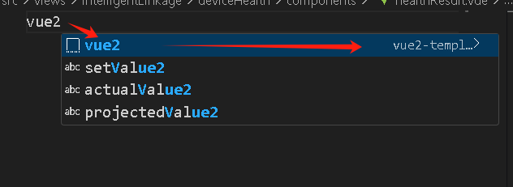
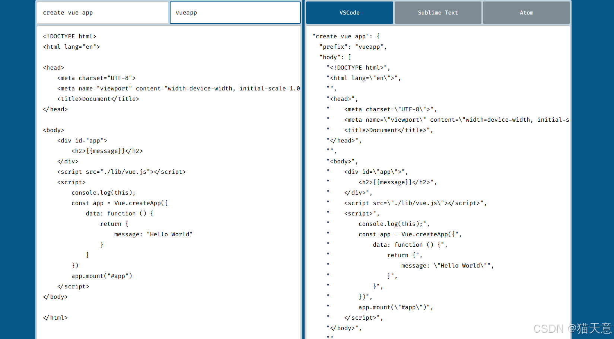

# vscode 配置

- 极大提高开发效率，提升开发体验

## 代码片段：

- 好处，输入 vue2, 就是模板的 prefix，就能弹出片段提示,非常智能、省事！

- 

### 代码片段-vue2 模板-vue.json

- 首先打开 vscode
- ctrl + shift + p
- 输入代码片段，选择 vue
- 在模板转换网站，将所需 vue 代码转换为模板
- 将模板填入以下 json

```json
{
  "vue2-template": {
    "prefix": "vue2",
    "body": [
      "<template>",
      "  <div>",
      "    $TM_FILENAME_BASE",
      "  </div>",
      "</template>",
      "<script>",
      "export default {",
      "  name: \"$TM_FILENAME_BASE\",",
      "  data() {",
      "    return {}",
      "  },",
      "  methods: {",
      "    ",
      "  }",
      "}",
      "</script>",
      "<style lang=\"less\" scoped>",
      "</style>"
    ],
    "description": "vue2-template"
  }
}
```

### 代码片段-文件头部注释

```json

  "File Header": {
    "prefix": "header",
    "body": [
      "/**",
      " * 文件名: $TM_FILENAME",
      " * 创建时间: $CURRENT_YEAR-$CURRENT_MONTH-$CURRENT_DATE $CURRENT_HOUR:$CURRENT_MINUTE:$CURRENT_SECOND",
      " * 作者: ${1:$TM_USERNAME}",
      " * 描述: ${2:这里写文件描述}",
      " */"
    ],
    "description": "插入文件头注释"
  }
```

### 在线模板转换

- 模板代码生成地址：https://snippet-generator.app
  

### 代码片段-模板规则

- 参考：https://blog.csdn.net/qq_45105203/article/details/141718358
