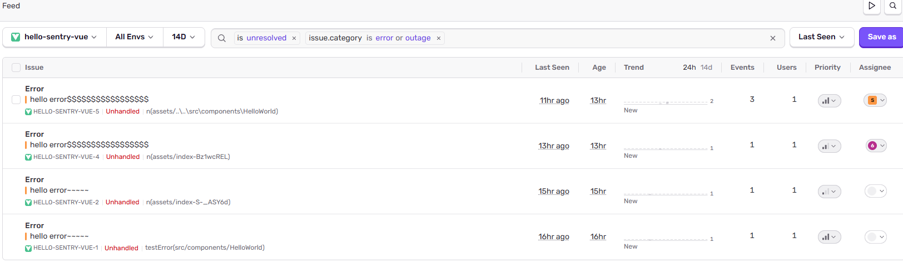
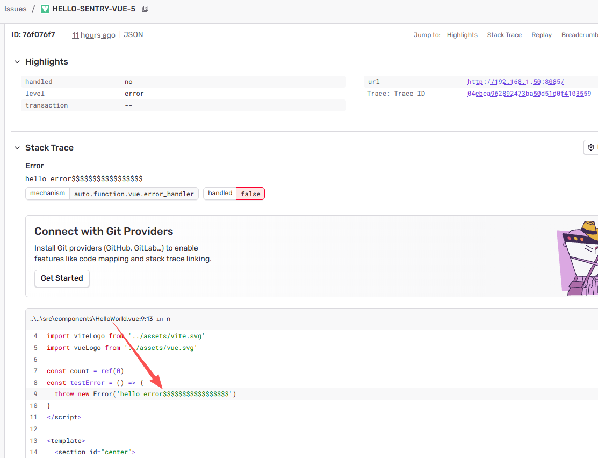
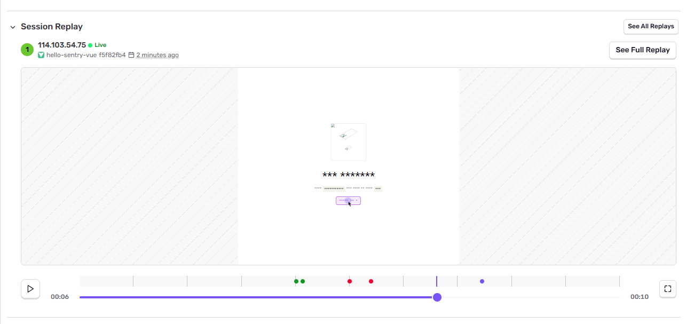
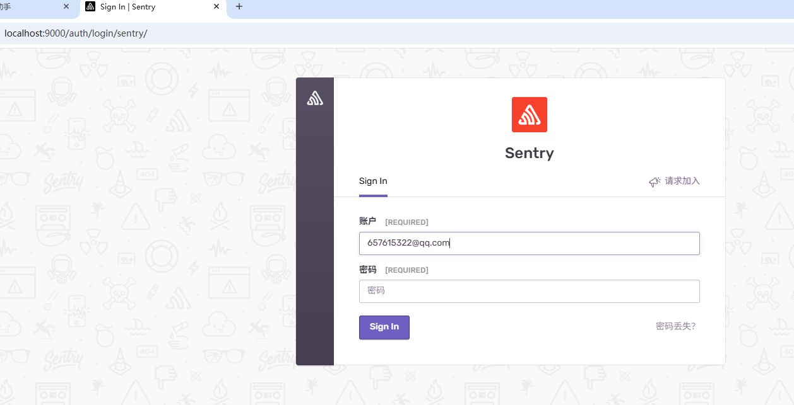
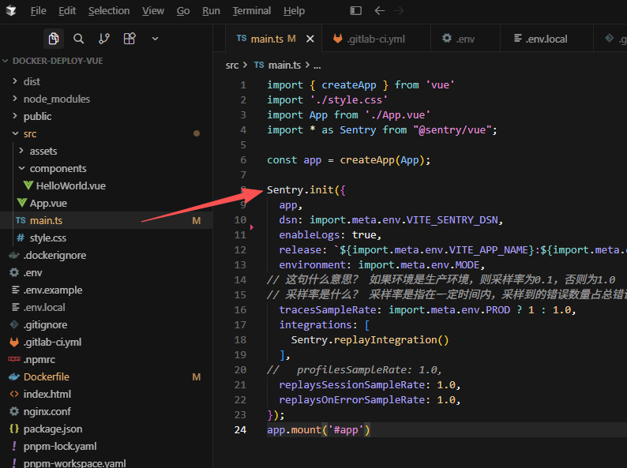
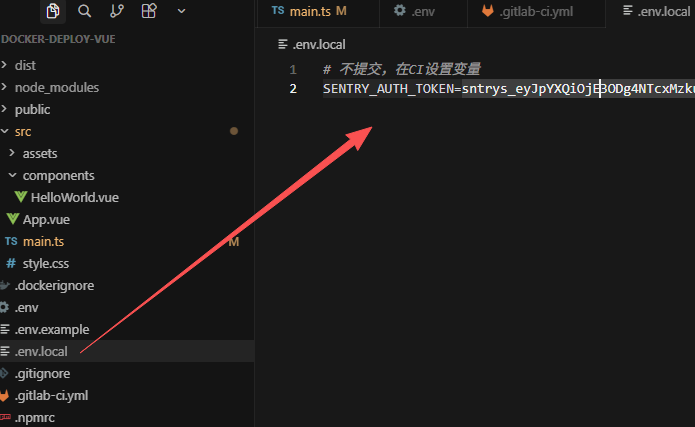
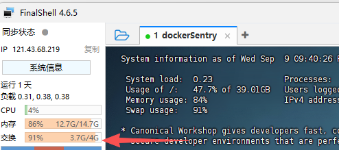

# 前端监控与Sentry自托管部署

## 解决什么问题？

- <b>前端监控</b>，帮助排查并解决报错故障，特别是针对线上的、过去发生的，以及偶发的故障进行追溯和复现，来提升生产环境页面稳定和安全
  - 页面的健壮性、安全性：不会因为一个报错，就崩溃，会有相应的错误兜底

## 怎么做

- 前端监控
  - 新增监控模块菜单，记录全局错误捕捉，错误详情，时间点，操作人等
  - 接入前端监控第三方管理系统，帮助监控
- 用户埋点
  - 通过页面停留时间，页面访问次数等数据，分析出用户偏爱哪些页面
  - 通过点击事件，拿到哪些按钮、链接比较受欢迎
  - 通过广告进入视口的时长和次数，来对广告进行收费等

## 监控系统

- 上报异常
  如果有必要的话，你可以把异常信息和日志，上报给监控服务器，然后集中分析。我每天上班第一件事，
  就是打开监控系统，看错误日志，然后对症下药解决问题。

## Sentry 第三方监控系统

### 现状
- 被动应对：线上问题靠测试和客户工单，客户发现问题或投诉。

### 解决什么问题
  - 实时感知：线上问题
  - 主动定位错误，行为还原
  - 监测性能: Sentry 会自动采集：
    - 页面加载 Transaction
    - 路由切换 Transaction
    - LCP / FCP / TTFB / CLS / INP
    - 前端资源加载
    - 接口耗时（如果匹配 tracePropagationTargets）
    - Long tasks（部分版本/配置）
    - Session Replay（看用户卡在哪）
  - 埋点分析，热力分析，业务发展提供数据依据
```ts
// src/instrument/sentry.ts
import { createApp } from 'vue'
import * as Sentry from '@sentry/vue'
import router from '@/router'

export function initSentry(app: ReturnType<typeof createApp>) {
  if (import.meta.env.DEV) return

  Sentry.init({
    app,
    dsn: 'https://xxx@o0.ingest.sentry.io/0',
    integrations: [
      Sentry.browserTracingIntegration({
        router, // Vue Router 路由性能
      }),
      Sentry.replayIntegration(),
    ],

    // 性能采样
    tracesSampleRate: 0.2,
    // Session Replay 采样
    replaysSessionSampleRate: 0.1,
    replaysOnErrorSampleRate: 1.0,

    // INP 在新版默认开
    enableInp: true,

    tracePropagationTargets: ['/api', 'your-api.com'],
  })
}
```
### 效果截图
- 错误列表

- 定位错误

- 录制用户界面报错前后的操作录频

### Sentry win11本地自托管部署
 - **部署步骤**
  ```text
    > 下载安装wsl2 
    > 下载安装docker-desktop 
    > docker配置registry-mirrors + wsl-integration 
    > 去Ubuntu拉sentry代码 
    > 安装镜像 ./install.sh  
    > 启动 docker compose up -d 
    > 访问sentry页面 localhost:9000
  ```

  - **获取sentry仓库代码**
  ```bash
    git clone https://github.com/getsentry/self-hosted.git --depth=1
    cd self-hosted
  ```
  - **配置.wslconfig**
    - 地址：C:\Users\\{当前windows用户名}\.wslconfig
```text
[wsl2]
memory=16GB # 限制 WSL2 虚拟机最多使用 16GB 物理内存；Sentry需要至少14GB
processors=4 # 限制 CPU 核心数，给 Windows 留余量。默认情况下 WSL2 会使用所有核心，这可能导致 Windows 本身变得卡顿
swap=8GB # 设置交换空间，内存不足时的缓冲
networkingMode=mirrored # 共享 Windows 网络栈，解决 NAT 隔离痛点
dnsTunneling=true # DNS 走虚拟化通道，VPN 下更稳定
firewall=true # Windows 防火墙规则覆盖 WSL 流量
autoProxy=true # 自动继承 Windows 代理，免手动配置

[experimental]
autoMemoryReclaim=gradual # 空闲时渐进回收内存，还给 Windows
```
  - **执行安装脚本**
  ```bash
    // 必须执行，拉取镜像+生成配置+初始化数据库
    ./install.sh
  ```
  - **启动服务**
  ```bash
  docker compose up -d
  ```
  - **访问Sentry页面**
  ```text
  http://localhost:9000
  ```
  
  - vue3接入Sentry
  
  - 生产环境接入Sentry需要在sentry平台申请Organization Tokens 即`SENTRY_AUTH_TOKEN`，本地在`.env.local`设置，gitlab-ci部署时在gitlab变量中设置
  

### Sentry 生产自托管部署
#### 踩坑注意
1. 服务器要求至少 4核 + 16G内存，如果不足建议配置Swap 做弹性内存，防止Sentry服务被杀导致OOM
    - Swap配置后，如果一直不生效需查看 `cat /proc/sys/vm/swappiness`
      - 若是0 则 内核会极力避免使用 Swap，直到物理内存几乎完全耗尽（或仅作为极端兜底） 内核被配置成"打死也不用 Swap"
      - 若为 60（默认常规值）：内存用到约 40% 时就会开始少量换页。
      - 云服务器为了追求性能，通常倾向于“尽量不用 Swap”，避免磁盘 I/O 拖慢响应
      - **需设置至少为** `10` 才会让 Swap 真正发挥作用（比如跑一些内存会偶尔飙高的服务） `sysctl vm.swappiness=10`
      - 这个交换就是swap，要是`docker compose up -d` 之后cpu与内存暴涨，`交换`却没动，就说明它没生效，就需要设置`sysctl vm.swappiness=10`，然后重启`up`让它生效
      
2. 登录后页面报`CSRF Validation Failed`
```text
CSRF Validation Failed
安全令牌不存在或无效

Rotate the CSRF Token
If you're continually seeing this issue, try the following steps:
```
   - 这个报错是 Sentry 自托管常见 CSRF 问题
   - 改配置（自托管）
    编辑 `sentry/sentry.conf.py`：
```python
  CSRF_TRUSTED_ORIGINS = [
    "https://sentry.example.com",
    "http://1.2.3.4:9000",
    "http://127.0.0.1:9000",
  ]
```
  - 然后重启web
    `docker compose restart web`


### **日常维护**
  ```bash
  # 启动所有服务（后台模式）, 不占命令行
  docker compose up -d

  # 加了 --wait：命令会一直阻塞等待，直到所有服务都达到 running 或 healthy 状态后才返回
  docker compose up --wait
  
  # 查看服务状态
  docker compose ps

  # 只停止服务
  docker compose stop

  # 停止后启动服务
  docker compose start

  # 只清理构建缓存（通常占用很大且不影响数据，可以清掉省空间）
  docker builder prune -a

  # 如果有哪个服务没起来，可以尝试，如relay, nginx没起来
  docker compose restart relay nginx
  
  # 停止服务并删除容器  ---慎用
  docker compose down

  ✅ 重启后建议执行的“灵魂命令”
  Sentry 的 Web 容器启动后，通常需要执行一次数据库迁移和初始化，否则即使容器显示 Up，也可能无法访问或功能异常。请在重启后执行：
  docker compose run --rm web upgrade

  # 仅删除所有 <none> 的悬空镜像。 安全性：绝对安全。它不会删除任何正在被容器使用的镜像，也不会影响你 Sentry 的运行
  docker image prune -f

  # 以下可以彻底重新来
  # 1. 停止并删除所有容器和网络
  docker compose down -v 

  # 2. 强制删除所有未使用的镜像（包括 sentry）----❌要慎重执行，防止删除其他项目镜像
  docker system prune -a -f 

  ```
| 操作 | 命令 |
|------|------|
| 启动 | `docker compose up -d` |
| 停止 | `docker compose stop` |
| 重启 | `docker compose restart` |
| 查看日志 | `docker compose logs -f` |
| 查看指定服务日志 | `docker compose logs -f web` |
| 升级 | `git pull && ./install.sh && docker compose up -d` |
| 完全删除重来 | `docker compose down -v && docker system prune -f` |


  - **其他命令**
  ```
  // 清理旧目录的残留
  cd /path/to/old/self-hosted
  docker compose down --remove-orphans

  //（可选）清理旧的无用镜像释放磁盘空间：
  docker image prune -f
  ```
### **常见问题**

#### 1. 权限问题
  - 当执行./install.sh很快结束，或执行 docker compose up -d 报以下错误，就是Ubuntu 用户权限问题

> permission denied while trying to connect to the docker API at unix:///var/run/docker.sock
  ```bash
  // 执行命令添加用户到 docker 组：
  sudo usermod -aG docker $USER
  // 刷新用户组权限（无需重启）：
  newgrp docker
  ```

#### 2. docker-desktop无法启动
  ```bash
  wsl --shutdown
  netsh winsock reset
  ```
#### 3. Ubuntu 启动报错
```
无法将磁盘“C:\Users\quantum6\AppData\Local\Packages\CanonicalGroupLimited.Ubuntu22
.04LTS_79rhkp1fndgsc\LocalState\ext4.vhdx”
附加到 WSL2： 系统找不到指定的文件。
错误代码: Wsl/Service/CreateInstance/MountVhd/HCS/ERROR_FILE_NOT_FOUND
Press any key to continue...
```
- 解决办法如下：
```Power Shell

PS C:\Users\quantum6> wsl --status
默认分发: docker-desktop
默认版本: 2

PS C:\Users\quantum6> wsl --shutdown

PS C:\Users\quantum6> wsl -l -v
  NAME              STATE           VERSION
* docker-desktop    Stopped         2
  Ubuntu-22.04      Stopped         2

PS C:\Users\quantum6> wsl --unregister Ubuntu-22.04
正在注销。
操作成功完成。

PS C:\Users\quantum6> wsl --install -d Ubuntu-22.04
Ubuntu 22.04 LTS 已安装。
正在启动 Ubuntu 22.04 LTS...
Installing, this may take a few minutes...
```
#### web 容器一直 unhealthy：
执行 `docker compose run --rm web upgrade`，然后 `docker compose restart web`
#### 端口 `9000` 被占用：编辑 `.env` 文件，修改 `SENTRY_BIND=9000` 为其他端口
#### 内存不足导致容器反复重启：`Sentry` 建议至少 `4GB` 内存，`WSL2` 下可在 `%UserProfile%\.wslconfig` 中配置 `memory=4GB`

### Sentry 自动采集 ≠ 完全不用写代码
Sentry 能自动做 80%，剩下 20% 要补：

1. **业务自定义耗时**
```ts
const span = Sentry.startInactiveSpan({ name: 'load-list-data', op: 'ui.task' })
await loadList()
span.end()
```

2. **web-vitals补上报**
```ts
import { onLCP, onCLS, onINP } from 'web-vitals'
import * as Sentry from '@sentry/vue'

function send(metric: any) {
  Sentry.getCurrentScope().setTag(`web_vital_${metric.name}`, metric.value)
}

onLCP(send)
onCLS(send)
onINP(send)
```

## 性能优化监控
1. ✅ 开发阶段
- Chrome DevTools
- Lighthouse
- vite build + rollup-plugin-visualizer（包体积）
2. ✅ 测试/预发
- web-vitals 打 console
- Performance 录屏
3. ✅ 生产
- Sentry（错误 + Tracing + Web Vitals + Replay）
- 自建 /api/vitals 上报（做自己的报表/告警）
- 路由级性能自己埋

### <b>页面埋点</b>：帮助分析用户偏好，提升用户体验
  - 曝光埋点
```js
// vue指令形式，当元素进入可见时，上报曝光事件
Vue.directive('exposure', {
  inserted(el, binding) {
    const observer = new IntersectionObserver(([entry]) => {
      if (entry.isIntersecting) {
        binding.value()
        observer.disobserve(el)
      }
    }, { threshold: 0.2 })

    observer.observe(el)
  }
})
// 使用指令
<div v-exposure="() => report('banner')"></div>
```