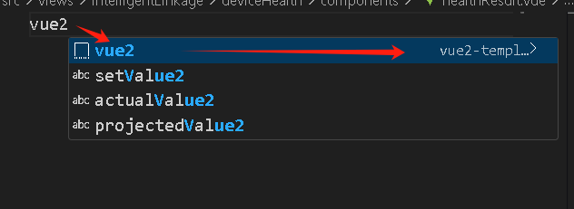

# 性能优化 <Badge type="warning" text="doing" />

## 是什么？
- 为谁优化？从用户体验出发，用户体验包括但不限于，
  - 网页加载速度
  - 交互响应速度
  - 页面和操作流畅度
  - 内存占用
- 从不同维度对前端应用进行性能优化，包括上线前，上线后，及用户使用体验等环节。
- 这是一个非常系统，包括前端项目的各个阶段的优化
- vue3官网也有性能优化建议：https://cn.vuejs.org/guide/best-practices/performance.html


## 性能优化监控
1. ✅ **开发阶段**
- Chrome DevTools
- Lighthouse
- vite build + rollup-plugin-visualizer（包体积）
2. ✅ **测试/预发**
- web-vitals 打 console
- Performance 录屏
3. ✅ **生产**
- Sentry（错误 + Tracing + Web Vitals + Replay）, 参考[monitor监控和埋点](./monitor.md)
- 自建 /api/vitals 上报（做自己的报表/告警）
- 路由级性能自己埋

## 首先定位项目性能瓶颈
**前端性能排查**的核心路径为， 以 Core Web Vitals 指标为基准：
- 通过 Lighthouse 快速定位方向，
- 利用 Performance 面板分析主线程阻塞，
- 借助 Network 面板排查网络请求瓶颈，
- 使用 Memory 面板追踪内存泄漏，最终结合具体代码落地优化。

### 📊 核心性能指标与阈值
当前主流采用 Google 的 **Core Web Vitals** 体系，结合其他关键指标，核心阈值如下：
| 指标 | 含义 | 优秀 | 需改进 | 差 |
|------|------|------|--------|-----|
| **LCP** | Largest Contentful Paint 最大内容绘制 主要内容绘制完了吗 | ≤2.5s | 2.5-4s | >4s |
| **INP** | Interaction to Next Paint 用户发起交互到下一次绘制（2024年起替代FID） 所有操作卡不卡 | ≤200ms | 200-500ms | >500ms |
| **CLS** | Cumulative Layout Shift 累积布局偏移 页面加载时乱跳吗 | ≤0.1 | 0.1-0.25 | >0.25 |
| **FCP** | First contentful Paint 首次内容绘制 页面开始显示内容了吗 | ≤1.8s | 1.8-3s | >3s |
| **TBT** | Total Blocking Time 总阻塞时间 主线程被卡了多久 | ≤200ms | 200-600ms | >600ms |
| **TTI** | Time to Interactive 可交互时间 页面什么时候能用 已从 Lighthouse 10 中移除，被 LCP、TBT、INP 等指标替代| ≤3.8s | — | — |
| **TTFB** | Time To First Byte 首字节时间 服务器响应速度 + 网络延迟 | ≤600ms | — | — |

### 🛠️ 测试工具与排查方法
#### Lighthouse：快速定位优化方向
Lighthouse 是 Chrome DevTools 内置的自动化审计工具，一键生成评分与优化建议。
**操作步骤**：
1. F12 打开 DevTools → 切换到 **Lighthouse** 标签
2. 选择 **Performance** 类别，建议先选 **Mobile** 设备（模拟中端手机+4G网络，更贴近真实用户）
3. 点击 **"Analyze page load"**
4. 查看生成的报告，重点关注：
   - **Performance 评分**：目标 >60 分，核心页面 >90 分
   - **各项指标的具体数值**和颜色标记（绿/黄/红）
   - **Diagnostics 区域**：列出了具体的优化建议，如"消除渲染阻塞资源""压缩图片"等
   - **Opportunities 区域**：按预期节省时间排序，优先处理排在前面的项

**Lighthouse 评分权重**：
- TBT（总阻塞时间）：30%
- LCP（最大内容绘制）：25%
- CLS（累积布局偏移）：15%
- FCP / SI / TTI：各 10%

#### Performance 面板：定位主线程瓶颈
这是分析**运行时性能**的核心工具，能精确到毫秒级看到哪个函数在阻塞主线程。
**操作步骤**：
1. F12 → 切换到 **Performance** 标签
2. 点击左上角 **⚙️ 设置按钮**，建议勾选：
   - **CPU throttling**：选择 `4x slowdown`（模拟移动端性能）
   - 勾选 Screenshots、Memory、Network 等录制选项
3. 点击 **🔴 Record** 按钮开始录制
4. 在页面上执行你要分析的操作（如页面加载、点击、滚动等）
5. 点击 **Stop** 停止录制

**怎么看录制结果**：
- **顶部概览区**：
  - **FPS 柱状图**：绿色越高越好，红色区域表示掉帧
  - **CPU 图表**：不同颜色代表不同类型活动——**黄色=JS执行**、**紫色=布局/样式计算**、**绿色=绘制**
  - **内存曲线**：持续上升不回落说明可能有内存泄漏
- **火焰图（Flame Chart）**：核心分析区域
  - 每一行代表一个函数调用，**越宽=耗时越长**
  - 自上而下是调用栈关系
  - 重点找**红色标记的长任务（Long Task）**，即超过 50ms 的任务
- **Bottom-Up 视图**：按函数自身耗时排序，直接告诉你**哪个函数最耗时**
  - 关注 **Self Time**（函数自身执行时间）和 **Total Time**（包含子函数调用）

**实战技巧**：
- 黄色区域过多 → JS 执行瓶颈，需要拆分长任务或使用 Web Worker
- 紫色区域过多 → 布局/样式计算瓶颈，减少强制同步布局
- 帧率低于 60fps → 动画/滚动卡顿，使用 `transform` 替代 `top/left`，利用 GPU 加速

#### Memory 面板：排查内存泄漏
**操作步骤（Heap Snapshot 对比法）**：
1. F12 → 切换到 **Memory** 标签
2. 选择 **Heap snapshot**，点击 **Take snapshot** 拍摄**第1次快照**（初始状态）
3. 执行可疑操作（如切换路由、打开弹窗、反复操作某个功能）
4. 点击 **Take snapshot** 拍摄**第2次快照**
5. 重复操作几次，拍摄**第3次快照**
6. 选择第2或第3个快照，在筛选框输入 **`Detached`**，筛选出"已脱离 DOM 树但未被回收的节点"

**怎么判断有泄漏**：
- 在 **Summary** 视图中，对比多次快照，如果某类对象（如 `array`、`Detached HTMLDivElement`）的数量和大小**持续增长**，说明存在泄漏
- 在 **Comparison** 视图中，直接对比两个快照的差异（`# Delta` 和 `Size Delta`）

**怎么定位到具体代码**：
1. 点击某个可疑对象（如 `Detached HTMLDivElement`）
2. 右侧 **Retainers** 面板会显示**引用链**——谁持有了这个对象的引用
3. 顺着引用链往上追溯，最终会指向某个**全局变量、未清除的定时器、未移除的事件监听器或闭包**
4. 在代码中找到对应位置修复

**常见内存泄漏类型**：
| 类型 | 原因 | 典型场景 |
|------|------|----------|
| DOM 引用泄漏 | 已移除的 DOM 节点仍被 JS 变量持有 | 组件卸载后未释放 DOM 缓存 |
| 闭包泄漏 | 闭包意外持有外层大变量 | 定时器/事件监听的闭包持有大数组 |
| 全局变量泄漏 | 未声明变量挂载到 window | `window.globalData = largeObj` 未置空 |
| 定时器/事件监听泄漏 | 未清除 setInterval / addEventListener | 组件卸载后未 clearInterval |

#### Network 面板：分析请求瀑布
**瀑布图颜色含义**：
- **灰色（Queueing/Stalled）**：排队等待，同一域名并发连接数超限（HTTP/1.1 默认 6 个）
- **深绿色（DNS Lookup）**：域名解析
- **橙色（Initial Connection）**：TCP 建连
- **紫色（SSL/TLS）**：安全连接协商
- **绿色（Waiting/TTFB）**：等待服务器响应
- **蓝色（Content Download）**：下载响应内容

**阶梯形状的请求有没有问题？**
**通常有问题。** 阶梯形状意味着请求是**串行**的——前一个请求完成后，下一个才开始。这就是所谓的**"请求瀑布"（Request Waterfall）**，本质是多个本可并行的请求被写成了串行。
例如：父组件请求数据 → 渲染子组件 → 子组件再请求数据 → 再渲染孙组件……每一层都多一次网络往返。在 250ms 延迟下，3 层串行就是 750ms 的纯等待。
**优化方式**：
- 将互不依赖的请求改为 `Promise.all()` 并行
- 使用路由级预加载（Prefetching）
- 在服务端一次性获取所有数据（SSR/RSC）

**什么是好的瀑布 vs 不好的瀑布**：
| 维度 | 好的瀑布 | 不好的瀑布 |
|------|----------|------------|
| **整体形状** | 请求尽量**并行**，整体宽度窄 | 请求**串行阶梯状**，整体宽度很宽 |
| **高度** | 请求数量少（越矮越好） | 请求数量多，大量小文件 |
| **颜色分布** | 大部分是蓝色（下载），TTFB 短 | 大量灰色（排队）、绿色（等待服务器） |
| **关键资源** | 首屏关键资源优先加载，渲染线靠左 | 非关键资源阻塞了首屏渲染 |
| **连接复用** | 同域名只建连 1-2 次，后续复用 | 每个请求都重新建连（大量橙色） |

**实战技巧**：
- 按 **Time 列降序**排列，优先排查耗时 Top5 的请求
- 若 **TTFB 占比大**（>50%）→ 后端处理慢，需优化接口或数据库
- 若 **Stalled/Queueing 占比大** → 并发请求过多，考虑合并请求或升级 HTTP/2
- 若 **Content Download 占比大** → 资源体积大，需压缩或使用懒加载
- 使用过滤表达式快速定位：`larger-than:1000`（大于1MB）、`status-code:404`（404请求）

### 🔧 从 Lighthouse 评分到实际解决
以一个典型电商首页为例（初始 Lighthouse 移动端 Performance 54 分），实战优化路径如下：
1. **LCP 过高（4.2s）**→ 首图 480KB PNG 未优化 → 转 WebP + `<link rel="preload">` 预加载 → LCP 降至 1.8s
2. **CLS 过高（0.35）**→ 图片无宽高 + 字体闪烁 → 加 `aspect-ratio` + `font-display: swap` + 骨架屏 → CLS 降至 0.06
3. **TBT 过高（620ms）**→ 路由同步导入全量代码 → `React.lazy()` 路由级代码分割 → TBT 降至 180ms
4. **二次审查**→ 发现字体未 preload、第三方 SDK 阻塞渲染 → 加 `<link rel="preload">` + `requestIdleCallback` 延迟初始化 → 最终 96 分

**核心优化手段速查**：
- **LCP 优化**：图片压缩/WebP、预加载关键资源、CDN 加速、减少渲染阻塞 JS/CSS
- **CLS 优化**：给图片/视频设置宽高、动态内容预留空间、`font-display: swap`
- **TBT/INP 优化**：代码分割、路由懒加载、虚拟滚动、Web Worker、`React.memo`/`useMemo` 减少无效渲染
- **网络优化**：HTTP/2 多路复用、Gzip/Brotli 压缩、缓存策略、预连接 `<link rel="preconnect">`

> 以上为千问回答

----

## 一、网页加载速度优化：解决用户「进页慢、白屏久」

加载速度是用户进入页面的第一观感，也是最基础的性能指标。对应的体验痛点是：页面打开白屏、加载转圈久、首屏内容迟迟不显示、二次访问依旧卡顿。这类优化**侧重上线前构建优化 \+ 上线后网络缓存优化**。

### 可落地优化手段

- **资源体积压缩（上线前必做）**：对 JS、CSS、HTML 代码进行压缩去重，移除注释与冗余代码；图片统一压缩并替换为 WebP/AVIF 格式，超大图做裁切适配；精简字体文件，摒弃冗余字体样式。

- **工程分包与按需加载（上线前架构优化）**：采用路由懒加载、组件按需引入，避免首屏打包体积过大；拆分第三方依赖包与业务代码，避免全局引入冗余库，通过 Tree\-Shaking 剔除无效代码。

- **网络传输优化（上线后配置）**：服务器开启 Gzip、Brotli 压缩，大幅缩小资源传输体积；配置静态资源强缓存、协商缓存，合理利用哈希命名更新缓存，提升用户二次访问速度。

- **首屏体验优化（用户使用层）**：内联首屏核心 CSS，避免渲染阻塞；非关键资源延迟加载、异步加载；搭配骨架屏、预加载策略，弱化用户白屏等待感知。

## 二、交互响应速度优化：解决用户「点击卡、反馈慢」

交互响应速度决定用户操作手感，痛点集中在：点击按钮无即时反馈、输入框打字延迟、弹窗切换卡顿、下拉刷新迟迟不响应。这类优化主要解决**主线程阻塞、无效高频执行、接口冗余请求**问题，贯穿开发与用户使用全程。

### 可落地优化手段

- **解决主线程阻塞**：拆分 50ms 以上长任务，复杂数据计算、逻辑处理放入 Web Worker，避免占用渲染主线程；页面交互过程中，禁止执行非必要的冗余计算和 DOM 操作。

- **高频事件防抖节流**：对输入框 input、页面滚动、窗口缩放、鼠标移动等高频事件，统一添加防抖、节流处理，减少函数无效执行次数，避免频繁阻塞线程。

- **交互逻辑优化**：按钮点击后即时禁用防重，添加 loading 状态反馈，让用户感知操作已生效；采用事件委托替代批量事件绑定，降低交互响应开销。

- **接口请求优化**：无依赖接口并行请求，减少串行等待；高频使用的静态数据、字典数据做前端本地缓存，优先读取缓存响应交互。

## 三、页面和操作流畅度优化：解决用户「滑动卡、动画掉帧」

页面流畅度核心看帧率，60fps 为标准流畅状态，低于 30fps 用户会明显感知卡顿。主要体验痛点：页面滚动卡顿、列表滑动掉帧、弹窗过渡动画抖动、页面切换不丝滑。优化核心是**减少浏览器重排重绘、优化渲染层级**，是用户使用阶段最直观的优化项。

### 可落地优化手段

- **规避高频重排重绘**：动画、过渡效果优先使用 transform、opacity 属性，仅触发图层合成，不触发布局重排；避免频繁修改宽高、定位等布局属性，批量统一修改 DOM 样式。

- **长列表专项优化**：千条以上大数据列表使用虚拟列表，只渲染可视区域 DOM，减少页面 DOM 节点数量；列表图片统一懒加载，避免一次性加载大量资源导致滚动卡顿。

- **动画渲染优化**：使用 requestAnimationFrame 实现动画，贴合浏览器渲染帧率；为核心动画开启 GPU 硬件加速，提升渲染流畅度；关闭页面隐藏区域的无效动画，节省渲染资源。

- **精简 DOM 结构**：减少无效嵌套 DOM、冗余占位节点，降低浏览器布局计算和渲染的开销，从底层提升页面流畅度。

## 四、内存占用优化：解决用户「越用越卡、页面闪退」

内存问题属于隐性性能问题，不会在首次打开页面暴露，而是用户长时间浏览、反复切换页面、频繁操作后，出现页面卡顿、浏览器内存飙升、移动端页面发烫、闪退等问题。这类优化重点在于**规避内存泄漏、管控内存占用**，覆盖开发编码规范与用户长期使用场景。

### 可落地优化手段

- **杜绝基础内存泄漏**：组件、页面卸载时，清空定时器、延时器、未完成的异步请求；解绑滚动、监听、自定义事件等全局监听，避免事件持续驻留内存。

- **规范变量与缓存使用**：避免滥用全局变量，防止数据无限堆积；及时清空无效闭包引用、废弃 DOM 节点引用，保证垃圾回收机制正常工作；限制本地缓存、全局临时数据的存储大小，定期清理过期数据。

- **框架专属优化**：Vue/React 项目中，在组件销毁生命周期中统一清理所有副作用；避免组件过度缓存，防止内存堆积；弹窗、浮层等临时组件使用后及时销毁，不残留实例。

- **大数据处理优化**：海量数据解析、渲染采用分片、分批处理，避免一次性加载解析数据造成内存峰值过高，导致页面卡顿崩溃。

## 五、总结：性能优化是全阶段的系统性工程

通过以上四大维度可以清晰看出：前端性能优化从来不是单点的技术优化，而是一套完整的体系。

从阶段来看：**上线前靠工程化、编码规范打底**，解决打包、代码、架构层面的基础性能问题；**上线后靠监控、缓存、网络配置迭代优化**；**用户使用阶段靠交互、渲染、内存管控提升体验**。

所有优化的终极目标始终不变：以用户体验为核心，解决加载慢、响应迟、操作卡、久用崩等真实用户痛点，让前端应用更流畅、更稳定。


## 2026年及以后

### 哪些维度
- 网络
- 资源加载维度

### 分维度进行说明，落地，量化

### 具体实施
#### 资源加载优化-图片优化
- 格式优化：avif、webp、png 利用picture 进行降级处理
  - vite项目，配合vite插件vite-plugin-image-optimization,把项目图片生成avif,webp格式
- 移动端或H5 做图片优化
  - 普通图可做清晰度优化：用picture的source的srcset 去自适应处理
  - 大图用响应式图片去节省流量：用picture的source的srcset、sizes 去自适应处理
```vue
  <!-- 格式优化 -->
  <picture>
    <source srcset="image.avif" type="image/avif">
    <source srcset="image.webp" type="image/webp">
    
  </picture>
  <!-- 普通图可做清晰度优化 -->
  <picture>
    <source srcset="
      image.avif 1x,
      image.avif@2x 2x"
    type="image/avif">
    <source srcset="
      image.webp 1x,
      image.webp@2x 2x"
    type="image/webp">
    
  </picture>
  <!-- 大图用响应式图片去节省流量 -->
  <picture>
    <source srcset="
      image-400.avif 400,
      image-800.avif 800,
      image-1200.avif 1200"
    sizes="(max-width:768px) 100vw, 1200px"
    type="image/avif">
    <source srcset="
      image-400.webp 400,
      image-800.webp 800,
      image-1200.webp 1200"
    sizes="(max-width:768px) 100vw, 1200px"
    type="image/webp">
    
  </picture>
```


## 2025年以前

### 是什么？

- 开发时、webpack/vite 编译构建时：
  - 从开发效率出发，为了让前端服务启动更快，热更新更快，打包构建更快。
  - 做到按需编译，不需要的不编译，合理利用多核并行构建，提升编译速度;合理利用缓存，提升二次编译速度。
- 上线后、运行时、访问页面时：
  - 从用户体验出发，提升页面加载速度，提升页面切换、操作、动画、交互的流畅度
  - 做到当前需要的优先加载，以后需要的空闲时加载，不需要的不加载等等。
  - 网络的性能优化：如请求缓存，promise 并发控制，不需要的请求可取消等等
  - 减少用户等待焦虑：骨架屏、交互反馈、防抖节流等

### 解决什么问题？

- 开发时
  - 开发效率慢：前端服务启动慢，热更新更慢，打包构建更慢
- 生产运行时
  - 用户体验差，页面白屏时间长、加载慢，页面切换、操作、动画、交互卡顿
  - 包体积过大，下载非常慢
  - 全项目的 js，都在首页下载，导致首页慢，白屏时间长
  - 发版之后，又得全量的下载所有新资源，如 新的 js,css,img 等，耗时，耗带宽，页面又慢
  - 随着项目越来越复杂，资源越来越多，页面会越来越慢
  - 思考：为什么要 splitChunks 把公共代码 common 抽出来呢？
    - 因为公共代码不抽离，那访问每个页面都得重新下载一次，做了重复工。
    - 所以抽出来，只需下载一次，其他页面都能复用。减少了带宽和下载的时间成本。
  - 思考：为什么第三方包抽到 vendors.js 里？为什么当 vendors 包太大了，又要把特定包从 vendors 中单独拿出来？
    - 因为三方包不怎么变动，每次打包上线后，都可以复用强缓存呀，只要访问过就能用现成的缓存，多快！
    - 那为何又要把特定包抽出来？因为 vendors 越来越大，下载越来越慢，有些三方包被拖累，变得也很慢
      - 有些三方包直接关系到首页加载速度，如首页轮播图 swiper 包，你可以把它单独抽出来，preload 去优先预加载
      - 还有些三方包，压根用户就不会去用，你也打包进 vendors 在首页下载，这合理吗？如下载 xlsx.js，crypto.js 等等，怎么办？你可在用到时 import('xlsx.js').then(...)去动态引入。
      - 个人想法：echarts 很大吧！如果首页没有用到 echarts,那么个人觉得如果不嫌麻烦，也可以通过 es6 的 import()动态加载 echarts, 并在浏览器空闲时预加载 echarts,等到用到时直接用缓存，这样是不是既减少了 vendors 包体积，又不影响 echarts 加载速度呢。
        ```js
         import(
          /\* webpackChunkName:"echarts" \*/
          /\* webpackPrefetch: true \*/
          'echarts').then(echarts => {// 在这写代码逻辑})
        ```
  - ...

为了解决上述问题，所以前端性能优化是势在必行！

### 什么是好的性能优化？

- 用户体验好
- 具体性能指标好，用数据说话。

### 怎么做

- 可参考：https://juejin.cn/post/7078491632605069348
- webpack 迁移 vite: https://juejin.cn/post/7129128214735093791

### 开发环境-编译时

#### 缩小范围

- include/exclude

#### 并行构建

- thread-loader/ happy-pack

#### 缓存

- 加快二次构建，直接复用，针对补偿变动的文件，提高构建效率
- cache-loader
- dll-plugin -旧版 webpack4 以下 缓存
- hard-source-webpack-plugin 构建缓存
  - dev: 75s -> 25s
  - prod:
  - 会造成项目报错？？
- webpack5-fileSystem

### 生产环境-运行时

#### 加载

- 体积小

  - webpack-bundle-analyse 去分析哪些 js 文件体积大
  - splitChunks 代码分割，或者叫拆包
    - 背景：一个入口模块，体积日渐庞大，一个文件如 10M，下载很久，阻塞 js 渲染页面，白屏时间很长，每次发版后还得重新下载一遍新的 js，用户体验极差。
    - 拆包优势
      - 1.splitChunks 拆出公共模块 common、不常改变的第三方包 vendor，二次访问直接用缓存，速度极快
      - 2.路由懒加载拆出每个路由页面的业务代码，访问时再下载 js
        - 配合魔法注释，webpackPreload 去优先加载首页代码，减少首屏白屏时间
        - 配合魔法注释，webpackPrefetch 在浏览器空闲时下载其他页面代码，减少其他页面进入时的加载时间
  - import()动态按需加载，即用时再加载，如 xlsx, lodash, echarts
    - 配合魔法注释 magic comments, 但优先级低于代码分割 splitChunks
    - 减少首页包体积，因为不用就不下载了，多好~
    ```js
        // 代码分割代码
        splitChunks: {
            chunks: 'all',
            cacheGroups: {
                vendors: {
                    name: 'vendors',
                    minSize: 0,
                    minChunks: 1,
                    test: /[\\/]node_modules[\\/]/,
                    priority: 2
                },
                // 把xlsx单独提出来，方便动态引入
                xlsx2: {
                    name: 'xlsx2',
                    minSize: 0,
                    minChunks: 1,
                    test: /[\\/]xlsx[\\/]/,
                    priority: 3
                }
            }
        }
        // A.js 4s后动态按需引入xlsx， 但异步块名称是上面的xlsx2，不是xlsxTest
        setTimeout(() => {
            import(
                /*webpackChunkName: "xlsxTest"*/
                'xlsx'
            ).then(res => {
                console.log('xlsx version==', res?.version)
            })
        },4000)
    ```
  - js 压缩：terser-plugin
    - 去掉注释、空格、console、debugger
    - 压缩、缩短变量和函数名
    - 预计算，将能计算的函数执行，拿到结果
  - css 压缩：cssnano
    - 去掉注释、空格、去掉无用 css
    - 合并选择器、压缩颜色值
    - 简化 css 代码
  - GZip 压缩
    - 前端打包 GZip
    - Nginx GZip 网络压缩
  - 图片压缩
    - imagemin-webpack-plugin
    - 转成 webp
    - 利用 picture、source、img 标签，针对不同设备加载不同清晰度、不同尺寸的图片，img 标签兼容低版本浏览器

- 网络

  - CDN
  - 请求缓存【一定时间内复用请求结果】，promise 并发控制，不需要的请求可取消等等

- 缓存
  - 强缓存
  - 协商缓存
  - memory cache
  - disk cache

### 渲染

- css
  - 抽单独 css 文件，比放在 js 中加载更快。通过 mini-css-extract-plugin
  - css 放在 head 中优先加载
- html
- js 阻塞

  - 普通 js 引入放在 body 最下方，防止阻塞 dom 加载，而加了 async、defer 的 js 不阻塞 dom，可放在 head 中引入
  - js 异步加载 async、defer

  ```vue
  <!-- 使js异步下载，下载完毕就执行，适合与dom无关的js -->
  <script src="xx.js" async />
  <!-- 使js异步下载，等dom加载完毕才执行，适合与dom有关的js -->
  <script src="xx.js" defer />
  ```

  - js 预加载 preload、prefetch

    ```vue
    <!-- 优先加载，适合加载当前页面的js等资源 -->
    <link src="xx.js" ref="preload" />
    <!-- 空闲时加载到缓存中，适合其他页面的js，等切到该页时直接从disk cache中获取，从而加快速度 -->
    <link src="xx.js" ref="prefetch" />
    ```

  - 参考：https://blog.csdn.net/huangpb123/article/details/84170557

## 从用户体验出发

- 骨架屏
  - 减少白屏时间，减少用户等待焦虑
- 节流防抖
  - 减少频繁操作，造成页面卡顿
