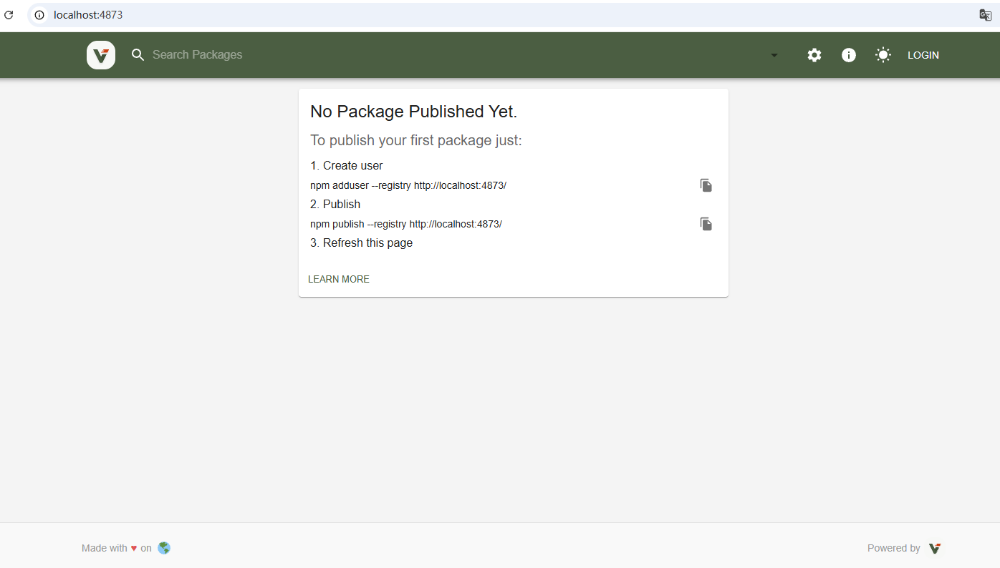
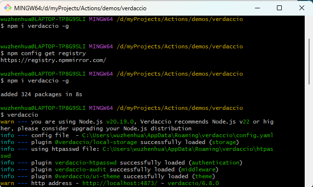

# 建设 NPM 私仓 - Verdaccio

## 是什么

> 轻量级 Node.js 私有 npm 仓库 / 代理缓存仓库（private npm registry）

- `Verdaccio` 是一个轻量级的私有 npm 仓库，目前在 GitHub 上有 17.7k Star。它不需要数据库，开箱即用，内置了自己的小型存储引擎，同时支持代理其他 registry（比如 npmjs.org），在拉取依赖时自动缓存下载的包。

- 语言：意大利语
- 原意：暗绿色 / 壁画底色
- 前端里：私有 npm 仓库工具 Verdaccio
> github: https://github.com/verdaccio/verdaccio

> NPM: https://www.npmjs.com/package/verdaccio

> 官网：https://www.verdaccio.org/

- 私仓项目启动页面


## 为什么
- 对于需要在公司内部使用 npm 包管理、又不想把代码推到公网的团队来说，`Verdaccio` 是一个直接可用的方案。

## 它能做什么
- 私有包管理
  - 在公司内部搭建私有 npm 仓库，发布和使用内部包的方式与公共 npm 完全一致。不需要额外的数据库，Verdaccio 自带轻量存储。

- 缓存公共 registry
  - 多台服务器安装依赖时，Verdaccio 可以作为中间层缓存 npmjs.org 的包。每个包每个版本只从上游拉取一次，后续请求直接走本地缓存。即使上游暂时不可用，缓存中的包仍然可用。

- 串联多个 registry
  - 组织内部有多个 registry 时，Verdaccio 的 uplinks 功能可以把它们串联起来，从一个统一的入口获取包，不用每台机器都配置多个源

## 怎么建设和部署
```bash
# 1. 确认 node 版本
node -v   # 要 18+

# 2. 装
npm i -g verdaccio

# 3. 改配置，允许外网访问
# 在 ~/.config/verdaccio/config.yaml 加一行：
# listen: 0.0.0.0:4873

# 4. 跑起来
verdaccio
```
启动成功如图


## 如何使用

```bash
# 创建用户
npm adduser --registry http://服务器IP:4873

# 配置根目录.npmrc: @mycompany/xxx 的npm包走私仓源， vue/react/lodash包还走公网npm（verdaccio 会做代理+缓存）
@mycompany:registry=http://服务器IP:4873
//服务器IP:4873/:_authToken=你的token        # 可不配，等npm login时在~/.npmrc自动生成

# 发布 npm 包 
# 注意：npm login 会在 ~/.npmrc 里生成 //服务器IP:4873/:_authToken=你的token，就无需在项目根目录.npmrc里写了
npm login --registry http://服务器IP:4873 
npm publish

# 项目安装 npm 包
npm i @company/eptable -S
# 使用私仓包
import EpTable from '@company/eptable'
```
## 私仓config
```yaml
storage: /verdaccio/storage

auth:
  htpasswd:
    file: /verdaccio/conf/htpasswd
    # max_users: -1  # 禁止 npm adduser 自助注册，可以手动在文件(~/verdaccio/conf/htpasswd)中添加 zhangsan:123456
    max_users: 50    # 允许50个人自助注册
    algorithm: bcrypt

uplinks:             # 上游源
  npmmirror:         # taobao 镜像
    url: https://registry.npmmirror.com
    timeout: 30s
    maxage: 10m
    max_fails: 3
    fail_timeout: 5m

  npmjs:                   # npm 官方源
    url: https://registry.npmjs.org
    timeout: 30s      

packages:
  # 公司私有包：绝不走公网
  '@mycompany/*':
    access: $authenticated
    publish: $authenticated
    unpublish: $authenticated
    proxy: []       # 公司私有包不走上游源，防止装到别人的包（未知风险）

  # 公共包：只读缓存
  '**':
    access: $all
    publish: $authenticated
    unpublish: $authenticated
    proxy: npmjs

security:
  api:
    jwt:
      sign:
        expiresIn: 30d

middlewares:
  audit:
    enabled: true

server:
  keepAliveTimeout: 60

log:
  type: stdout
  format: pretty
  level: http
```
## Monorepo架构下，子包的发布
- 同样支持根目录下的.npmrc
```.npmrc
@mycompany:registry=http://服务器IP:4873
```
- 发布包

- 发布时，子包 package.json 注意点
```json
{
  "name": "@company/eptable",
  "version": "1.0.0",
  "type": "module",
  "main": "./dist/index.js",
  "types": "./dist/index.d.ts",
  "exports": {
    ".": {
      "import": "./dist/index.js",
      "types": "./dist/index.d.ts"
    }
  },
  "files": ["dist"]
}
```

- Monorepo 子包之间互相引用
```json
"@company/epform": "workspace:*"
```

发布后 pnpm 会把 `workspace:*` 换成真实版本号

### 本地发布单个包
```bash
# 首先登录
npm login
pnpm --filter @company/eptable build
pnpm --filter @company/eptable publish
```

### 本地发布所有包
```bash
# 首先登录
pnpm run build -r
pnpm run publish -r  # -r 是 --recursive 的缩写，意思是递归地把所有版本有变化的包都发上去。
```

### 发包处理版本问题

Monorepo包一多，需要通过 changesets 管理版本

```bash
pnpm add @changesets/cli -Dw     # 安装 -D是编译时依赖 -w是根目录安装
pnpm changeset init
```

- 开发完
```bash
pnpm changeset   # 记一下改了什么
```

- 发布时

```bash
pnpm changeset version  # 改一下版本
pnpm build -r    # 打包
pnpm publish -r  # 发布 
```