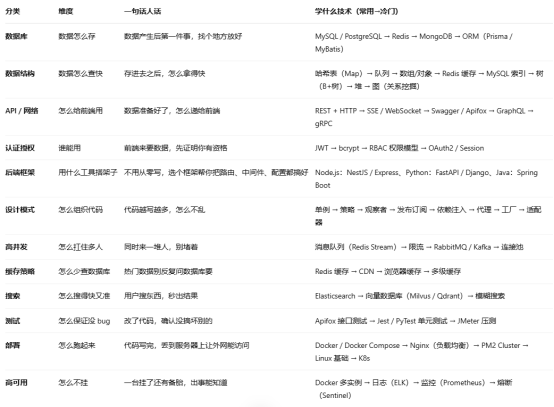
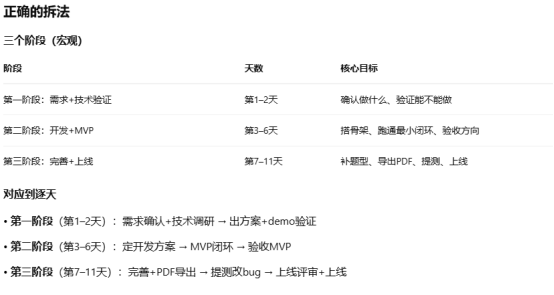
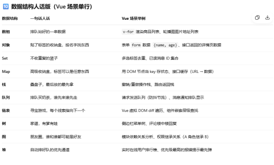

# 20260921面试总结

## 为啥复盘总结？
面试一开始感觉还行，但对了答案发现很多不足，暴露不少短板，看到更广的后端技能维度，所以总结一下！

## 一.自我介绍

1.10年前端 主栈vue+ts, 熟悉react,uniapp,electron跨端开发,上家物联网/电力行业，擅长基础架构，工程化体系建设，性能优化等；对数字化教育也很感兴趣，未来会往AI全栈方向发展，为数字化教育赋能。

## 二.后端的了解深度

### 问题1: 讲一下你对后端的了解，比如在设计模式，高并发，高可用，数据结构、数据库，性能方面都可以
答：数据库方面如：用express做过博客后台接口，用过mysql，mongodb；MVC设计模式；nestjs的依赖注入和装饰器设计模式；了解消息队列rabbitMQ,kafka，没做过但知道；
正解：应该多讲一点吧, 如下图

> PS: 数据结构在前后端的应用，见文末
## 三.Vue的设计模式

### 问题2：vue3的父子组件的emit,on和react的回调函数传参是什么设计模式？
答：首先是解决props传参的单向数据流问题；是发布订阅模式（不准确）;
正解：
- Vue 
子组件 emit 是自定义事件，父组件监听；它不是 DOM 事件，但借鉴了事件机制。
你之前学的是：
emit 有事件名、有 _events 表、有订阅/发布动作 → 像发布-订阅
这没错，但设计模式不是看"动作像不像"，而是看"解决的问题是什么"：
如果目的是解耦 → 发布-订阅 
如果目的是"状态变化时通知已知观察者" → 观察者 
父子组件不需要解耦，所以观察者模式更贴切。
如果用 EventBus / mitt 跨模块通信，才是典型发布订阅。
- React
React 没有“子向父发事件”的框架语义，而是状态提升 + 函数作为 props 下发。
父把 callback 传给子，子调用 callback 把数据交回去。
本质是：单向数据流 + 函数式组合，不是事件系统。

### 问题3：element-plus的el-form的校验rules是什么设计模式？
答：没研究过，怕思考浪费面试时间，过。。。
正解：el-form 的 rules 不是单一模式：
单条规则是策略模式，字段多规则执行是责任链/管道，整个表单统一 validate 是门面模式（Facade）。-这一句出来，面试官会点头。
展开：
每个rule是一个校验策略：require,min,max，validator...
字段对应一组rule: 按顺序执行，像管道
一条不过就收集错误：像责任链
自定义validator: 策略可插拔

### 问题4：vue2/vue3响应式数据是什么设计模式？
答：
- 发布订阅是：有一个事件中心，发布者和订阅者互相解耦；
- 观察者模式是：观察者被加到被观察者的队列里，等被观察者emit,观察者能接收到；
- Vue3是proxy代理，在数据访问时get收集依赖，在set时触发依赖，有一个Deps类去管理：是观察者模式
- Vue2忘记说了。。。

正解：
- vue2是观察者模式，
    - 每个属性都会创建一个Dep实例dep,
    - Object,defineProperty去拦截属性访问，
    - get时，dep 调dep.addSub直接把watcher添加到观察者集合subs，
    - set时，dep.notify通知所有watcher更新；
    - watcher是直接加到dep实例属性subs上的，无事件名/主题代号隔离，即没有事件中心，所以不是发布-订阅模式
- vue3是proxy代理模式 + 发布订阅模式；
    - 代理模式：vue3 proxy去做劫持是代理模式，
    - 发布订阅模式：
        - targetMap
            - .get(target) ➡ depsMap
            - .get(key)  ➡ depSet<effect...> 拿到该target的key的depSet
        - 通过targetMap做依赖中心，target + key作为事件主题
        - proxy.get时track 收集依赖 把effect 加到depSet
        - proxy.set时trigger 触发依赖 depSet 调度执行effect 更新
        - 有依赖/事件中心targetMap, 有事件主题代号隔离target+key，所以是发布订阅模式
总结发布-订阅模式
发布者和订阅者只认事件名，不认识对方是谁，比如小吴.on('发工资') 老钱.emit('发工资', 2w), 小吴和老钱只跟事件名对话；
总结观察者模式	
没有事件名, 它是 发工资事项Subject.addObserver(小吴)，然后发工资时，Subject.notify 通知所有员工，然后小吴.update()，小李.update()

## 四.Git分支管理与任务排期
### 问题5：当你手上有三个并行任务时，你怎么管理git分支？
答：首先处理重要紧急的任务，如生产bug热修，会拉一个hotfix分支去修，修完评审上线，之后在下个版本把master分支最新代码合到dev开发分支；
其他两个任务，分别拉一个feature分支去开发，就跟把任务分给组员一样。
### 问题6：场景题：有一个较复杂的任务，你怎么进行任务排期：需求是：要做一个教师选题，然后在线生成word试卷，支持A3/A4纸，设置页眉页脚，分页，边距等精细化控制，并且支持导出word/pdf；
- 自己答：
然后沉默思考4分钟。。。（这里没有给面试官信号，可以说我需要2分钟思考一下）
开始作答：
首先分析需求：要在后台管理的加两个菜单：试题管理+试卷管理；然后列表和页面清单，组件，接口整理，我交给组员去做；核心的在线word我去调研；
面试管提醒我：我要任务排期的时间点。。
    调研需要2-3天,搭基础框架+同事开发时间2-3天， ----- 一周时间
下周开发 + 最小的MVP可用闭环 + 单元测试/冒烟测试+ 代码审查 + 提测+ 产品经理去验证功能  ---- 一周时间
第三周上线；
        面试官：三周上线是吧，好。

- 复盘分析：
1. 思考时间略长 ！
2. 技术方案/技术demo没有提前确认, 有风险！！
3. 没有拆最小链路（选题，预览word, 导出A3/A4纸），即MVP，跑通后提前找产品确认方向是否正确  ！！
4. 最后才是完善细节，修复边界问题（超100道题性能如何、不同题型、数学物理公式、特殊字符展示等）
5. 没有明确的里程碑：如直接表明定了5个里程碑阶段：！
    - (1)需求确认+技术方案/最小demo方向确认+定开发方案 （第1-3天 2-3d） 		-------------此时技术方案已确定，风险消除一半！！！
    - (2)开发跑通最小链路MVP+验收方向 （第4-6天 2-3d） 
-------------此时核心流程已跑通（风险已消除！！！）
    - (3)完善功能，修复边界问题 （第7-8天 1-2d）
    - (4)自测/提测/修bug/验收完整版 （第9-10天 1-2d ）
    - (5)上线部署 （第11天 1d）
6. 没有在各个环节利用AI提效

---

- 元宝答案： 核心思想：风险前置 + 有里程碑节点（区别于流水账式）
这个需求我拆成三个阶段（“里程碑”）： 

具体细节（如果面试官要展开的话）：
- 第1天：需求确认+技术调研
跟产品确认试卷格式（A3/A4、单双栏、密封线）、页眉页脚内容、导出格式。同时让AI帮我整理技术方案提示词，调研docx-templater和docx.js的对比。
- 第2天：出技术方案+最小demo验证
用docx-templater跑一个带页眉页脚、分页、边距的样例试卷，验证排版精度。拉产品和UI过方案——确认"预览长什么样、导出精度到什么程度"。
- 第3天：定开发方案
页面清单（试题管理、试卷管理、选题、预览、导出）、接口契约（题库接口、组卷接口、导出接口）、数据流转。我搭骨架，定义组件结构和状态管理。
- 第4–5天：MVP闭环
选题→预览→导出docx，跑通最小链路。两天出demo。
- 第6天：验收MVP
教研老师/产品验证：选题逻辑对不对、导出格式满不满足、分页有没有断题。不对就调，对就继续。
- 第7–8天：完善+PDF导出
题型全覆盖（单选/多选/判断/填空/问答）、模板细节调整、PDF导出（docx→libreoffice转pdf或pdfmake）。自测+冒烟。
- 第9–10天：提测+改bug+上线评审
提测、修边界case（100题以上性能、特殊字符、图片题）、上线评审。
- 第11天（第三周周一）：上线
留20%buffer应对模板调整或导出精度问题。如果需求紧急可以砍预览功能先做导出，宽裕的话可以加模板保存和复用。

- 面试前准备3–5个"万能框架"  ---------相对好记！！！
排期题的万能框架就一个：
- 需求确认 → 风险识别 → 方案验证（demo/技术选型）→ 拆任务 → MVP → 验收 → 完善 → 提测 → 上线

-----------------------

非面试内容补充：数据结构在前后端的应用
前端版 
- 写页面​ → 数组 + 对象（90% 场景）
- 做交互​ → 栈 + 队列（撤销、排队）
- 搞性能​ → Set + Map（去重、缓存）
- 啃源码​ → 链表 + 树（虚拟 DOM、组件树）
- 管状态​ → 对象 + 树（状态树、路由树）

后端版 
- 写接口​ → 数组 + 对象（每天在用）
- 做缓存​ → Map + Set（Redis 核心思想）
- 搞异步​ → 队列（消息队列是后端基本功）
- 啃性能​ → 链表 + 树 + 堆（索引、缓存淘汰、调度）
- 管并发​ → 队列 + Map（线程池、ConcurrentHashMap）
- 做搜索​ → 树（Trie 前缀匹配）
- 搞推荐/风控​ → 图（关系挖掘）
- 做限流​ → 数组（滑动窗口）+ 队列（漏桶/令牌桶）

前后端对比版（一句话看懂区别） 
- 场景	前端在干嘛	后端在干嘛
- 数据存哪​	内存里的数组/对象，刷新就没了	数据库 + Redis，重启还在
- 数据怎么传​	对象打包发给后端	对象拆开存进数据库
- 列表展示​	数组 → v-for 渲染成 DOM 树	数组从数据库查出来返回给前端
- 缓存​	Set/Map 存组件状态	Map/Set 做 Redis 缓存层
- 排队​	请求队列、消息通知排队	消息队列、异步任务消费
- 性能优化​	虚拟 DOM diff（链表+树）	数据库索引（B+树）、缓存淘汰（堆）
- 关系处理​	组件父子嵌套（树）	权限继承、社交关系（图）
- 用户操作​	撤销重做（栈）	事务回滚（也是栈的思想）

数据结构人话版

