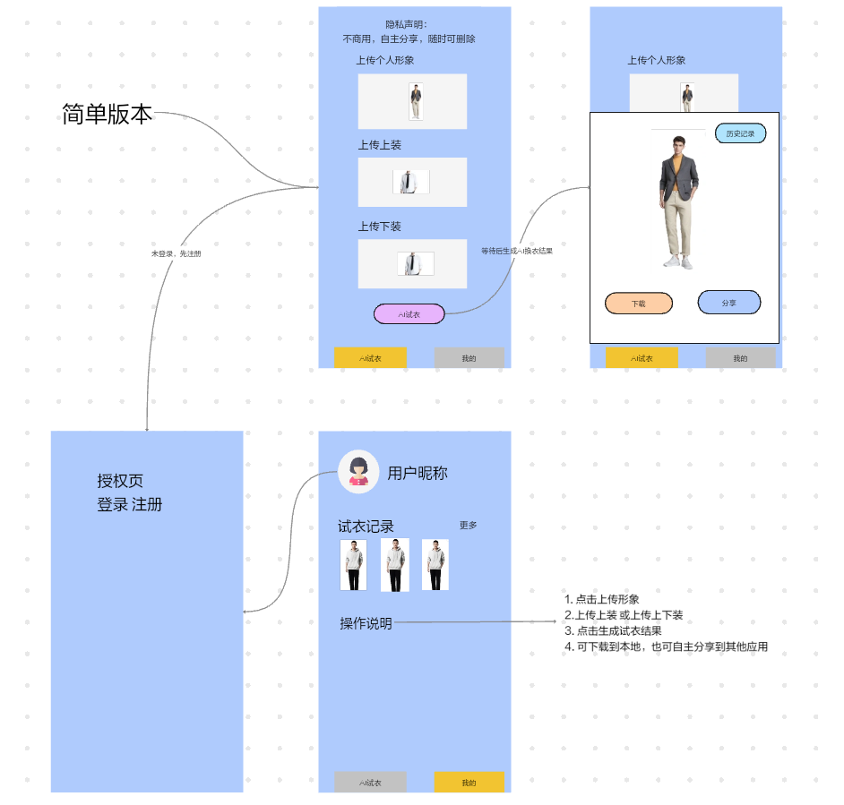
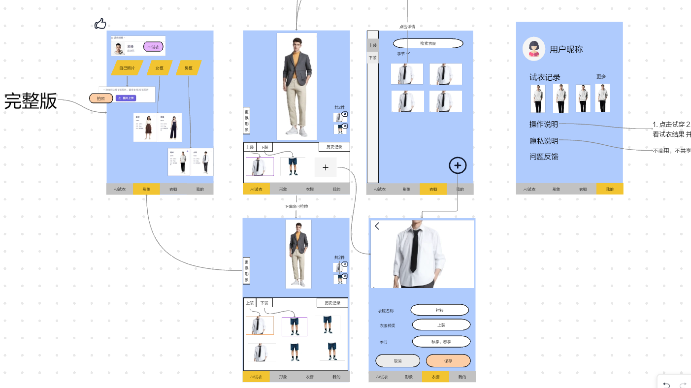

# wx智能试衣app <Badge type="tip" text="done" />
## 项目背景与介绍
- 背景：现在电商有很多AI试穿功能，但大多基于店铺商品，我想做一个基于用户衣橱的AI试衣功能。
- 介绍：一款用户可以自主上传形象和衣服，自主管理已上传的形象和衣橱衣服，智能生成试衣效果的app。
- 客户端：小程序/H5端/安卓端，ios端本地支持但未发布。

## 项目地址
- 腾讯云原生仓库CNB（代码）: https://cnb.cool/wuxi-2026/wx-ai-tryon
- uniCloud 网页托管（H5体验）: https://env-00jy6l3d83tr-static.normal.cloudstatic.cn
- 蒲公英（安卓端）: https://www.pgyer.com/wxzhinengshiyi?sig=YlSA2SCpaTtGivXMjgZHjnmUZp63FagUHYQLUi9%2Bpmko5bQJt8W%2B58BcjElW%2BBPYLrOYgV4btLqsZk5CflM6KQ%3D%3D
    - 密码：111111
    - 
- 微信小程序：（AI深度合成类目卡个人开发者，暂未备案与发布）

## 功能与特性

## 技术分析
- 用户端：小程序/H5/移动端：Uniapp + Vue3 + ts
- 服务端：unicloud(alypay) + 云函数
- 持久化数据：unicloud数据库
- 云存储：uniCloud云存储+外扩存储
- 模型：腾讯云混元生图-模特换装

## 线框设计图
- 首发版

- 完整版 【待开发】

## 项目截图

## 核心数据流转