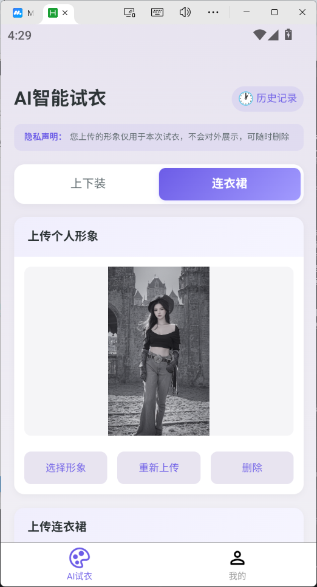
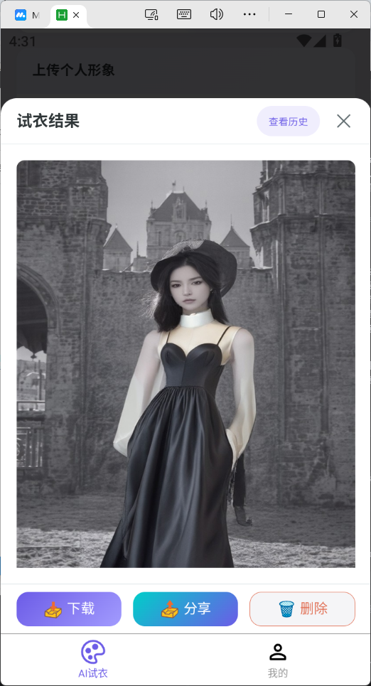
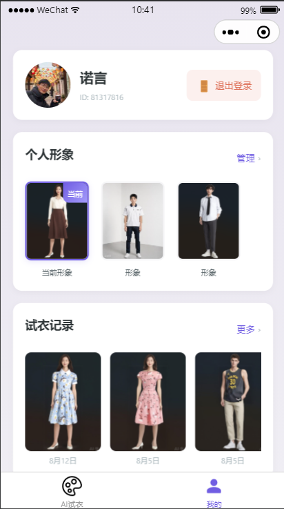
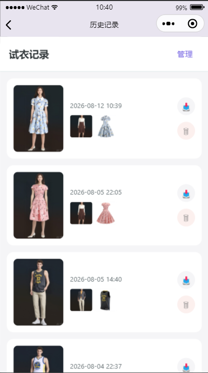

# Uniapp智能试衣app <Badge type="tip" text="done" />
## 项目背景与介绍
- 背景：现在电商有很多AI试穿功能，但大多基于店铺商品，我想做一个基于用户衣橱的AI试衣功能。
- 介绍：一款用户可以自主上传形象和衣服，自主管理已上传的形象和衣橱衣服，智能生成试衣效果的app。
- 多端支持：小程序/H5/安卓端。

## 项目地址
- 腾讯云原生仓库CNB（代码）: https://cnb.cool/wuxi-2026/wx-ai-tryon
- uniCloud 网页托管（H5体验）: https://env-00jy6l3d83tr-static.normal.cloudstatic.cn
- 蒲公英（安卓端内测）: https://www.pgyer.com/wxzhinengshiyi?sig=YlSA2SCpaTtGivXMjgZHjnmUZp63FagUHYQLUi9%2Bpmko5bQJt8W%2B58BcjElW%2BBPYLrOYgV4btLqsZk5CflM6KQ%3D%3D
    - 密码：111111
    - 
- 微信小程序（体验版）：（AI深度合成类目卡个人开发者，暂未备案与发布）, 需要添加体验成员请联系作者邮箱：657615322@qq.com

## 功能与特性
- 自主形象管理
- 一键试衣功能
- 试衣历史记录管理
- 微信授权登录，h5/移动端体验登录
- 试衣结果安全：目前请求腾讯云模特换装接口，由腾讯云TC3加密授权，保障数据安全。
- 子管理多品类衣橱（doing）
- 安全加密：AES-256加密存储。（doing）
- 支付宝小程序授权登录，目前支持体验登录（doing）
- 移动端app 手机号登录，多端数据同步（doing）
- 种草社区：用户可以在小程序/移动端种草其他用户的试衣效果，也可以查看其他用户的试衣效果。分享衣服链接等等（doing）
- 衣服搭配推荐：根据用户试衣历史记录，推荐用户试衣的搭配搭配。（doing）

## 技术栈说明
- 用户端：小程序/H5/移动端
    - Uniapp：跨平台
    - Vue3：数据驱动视图
    - ts：类型安全
    - vite: 极速构建工具
- 服务端：unicloud(alypay) + 云函数
- 持久化数据：unicloud数据库
- 云存储：uniCloud云存储+外扩存储
- 模型：腾讯云混元生图-模特换装
- 开发编辑器：
    - Trae 用于AI coding编程
    - hbuilderx 
        - 启动uniCloud云服务
        - 运行小程序/H5项目 + H5自动部署 + 安卓/IOS运行与云打包
    - 微信开发者工具/支付宝开发者工具：小程序端运行，代码上传与部署发版
    - MuMuPlayer 安卓模拟器 运行调试安卓端
    - Xcode ios模拟器 调试和部署ios端
## 核心数据流转
- 用户上传形象：用户在小程序/移动端上传形象，前端直传uni.uploadFile到云存储，将用户openId + cloudPath存储在unicloud数据库中。
- 用户上传衣服：用户上传衣服，前端直传uni.uploadFile上传到云存储，将cloudPath转成临时URL，在前端展示。
- 用户试衣：点击一键试衣，系统根据用户上传的形象和衣服，通过云函数按照腾讯云TC3加密授权调用模特换装接口，生成试衣效果图，返回给云函数，云函数将试衣图cloudPath存入unicloud云存储，再将用户openId + cloudPath存入云数据库。
- 用户试衣历史记录：根据用户的openId从数据库拿到自己的试衣历史记录。
## 线框设计图
- 首发版

- 完整版 【待完善】

## 项目截图

