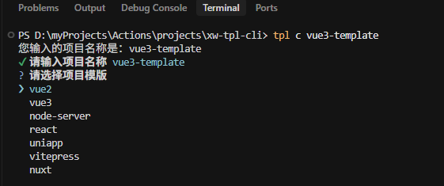
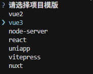
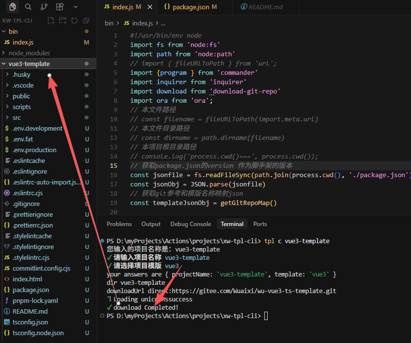

# Nodejs命令行工具-大前端模板脚手架xw-tpl-cli <Badge type="warning" text="doing" />

## 背景
- 当我们创建新项目，如果之前做过类似项目，即便能拿来用，还得去一个个翻找代码仓库
- 而使用xw-tpl-cli开源项目，可以预先将自己所有的模板项目【项目名称 + 仓库地址】内置到xw-tpl-cli选项当中，作为个人模板集合。
- 这样之后，命令行一行命令，tpl create 就能交互式地去拉取想要的项目模板，
- 也可以开源分享到 **NPM** 给其他人使用。

## 项目介绍

- 帮您快速创建大前端工程化项目模板，一行命令tpl create 跟 vue-cli交互一样，拉取指定仓库的所需项目代码。 
- 目的是快速开始项目，减少从零搭建的繁杂工作。

## 项目地址
- Gitee：https://gitee.com/Wuaixi/xw-tpl-cli
- Npm: https://www.npmjs.com/package/xw-tpl-cli

- 命令行创建


<!-- - 内置模板列表
 -->
- 选中模板，下载模板代码



## 如何使用
- 执行一行命令即可，确认项目名称，再按提示选择模板
```bash
tpl create <templateName>
// 简写
tpl c <templateName>
// 脚手架版本
tpl -V 
```
- 内置一些模板可供使用
```js
{
    "vue2": "https://gitee.com/Wuaixi/xw-vue-template.git",
    "vue3": "https://gitee.com/Wuaixi/wu-vue3-ts-template.git",
    "node-server": "https://github.com/15240021857/xw-node-blog-server.git",
    "react": "https://github.com/15240021857/react-frame.git",
    "uniapp": "https://github.com/15240021857/xw-chart-app.git",
    "vitepress": "https://github.com/15240021857/web-docs.git",
    "nuxt": "https://github.com/15240021857/xw-nuxt-vue2-template.git"
}
```


