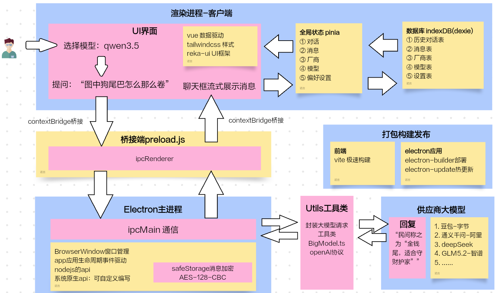
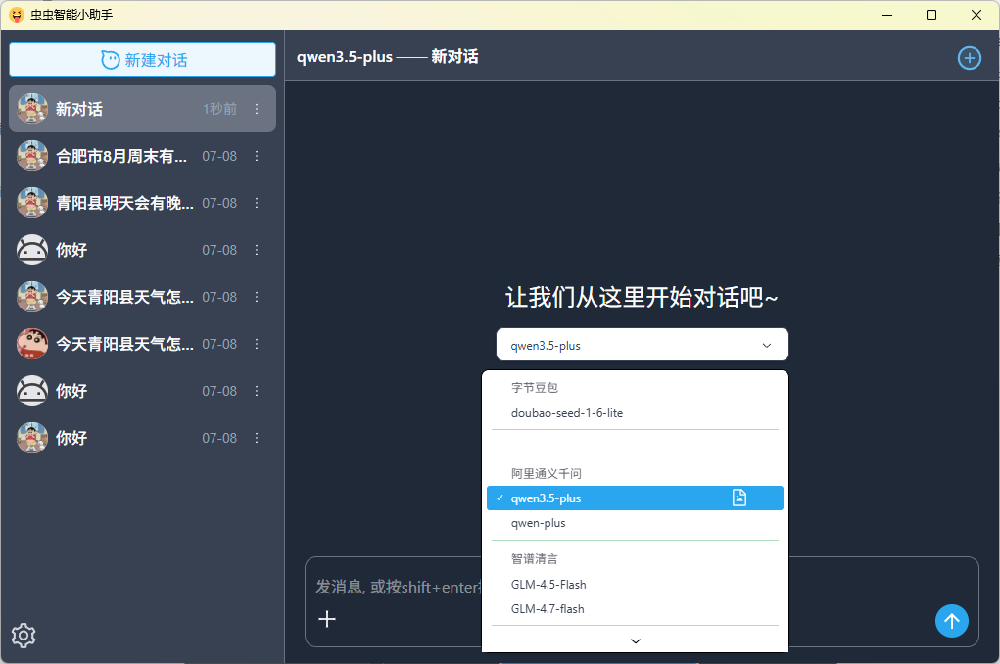
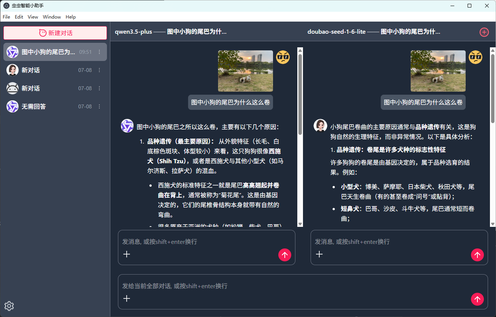
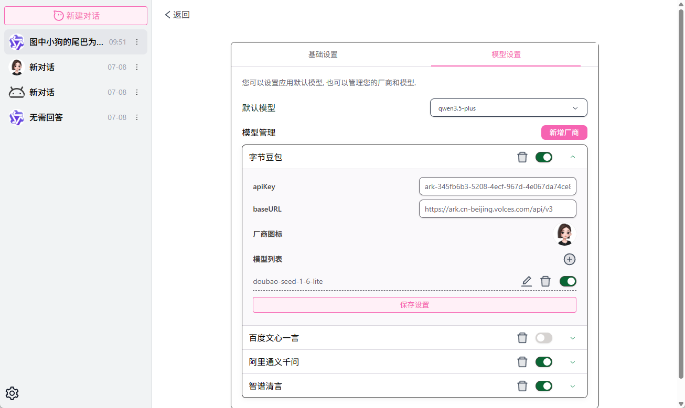
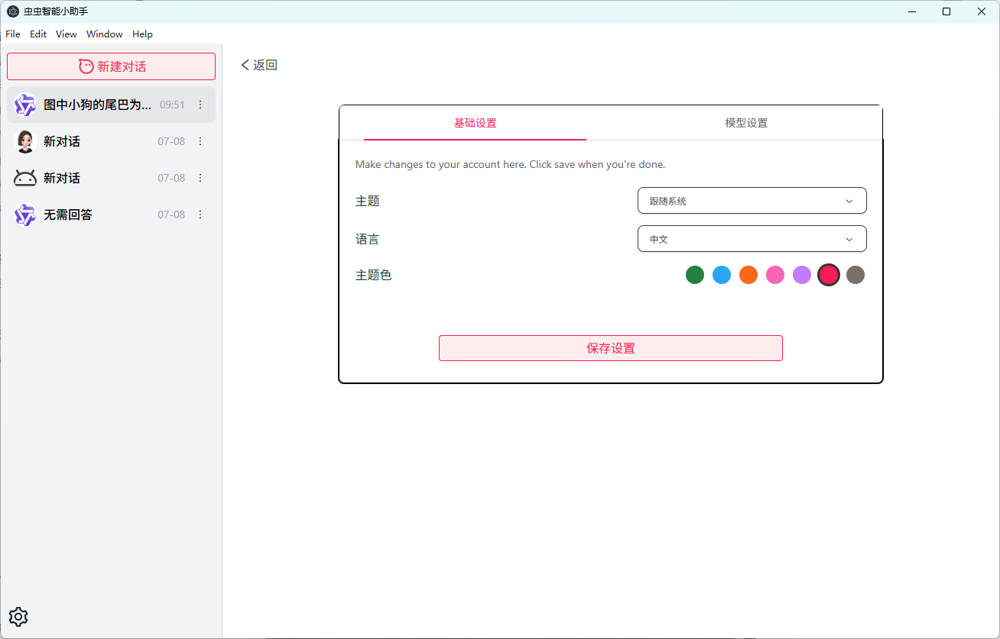

# Electron LLM智能聊天桌面端软件 <Badge type="tip" text="done" />

## 项目背景与介绍
- 背景：市面上不缺智能聊天软件，但可能缺少一个自主管理多模型，且支持创建多个子对话，自主对比模型回答的软件。
- 介绍：桌面端智能助理聊天软件，自主管理接入多个模型可供选择，如字节豆包，智谱清言GLM, 阿里千问等，特别支持创建多个子窗口同时对话，用户可自主对比出喜欢的回答。

## 项目地址
- Github repo（代码）: https://github.com/15240021857/wx-electron-intel-chat
- Github release（软件包）: https://github.com/15240021857/wx-electron-intel-chat/releases

## 功能与特性
- 跨window/mac电脑系统, 下载即可使用智能聊天，为您答疑解惑，多种主流大模型可供选择。
- 支持智能体切换，用户可以按需选择不同的智能体。
- 支持多个对话聊天框横向对比（多个子对话窗口）
- 支持厂商模型自管理
- 支持多语言zh-CN, en
- 支持浅色/暗色主题切换，支持自定义主题颜色
- 支持软件热更新
- 聊天信息AES‑128‑CBC加密存储，用户数据安全，safeStorage适合本地桌面LLM聊天软件。(doing)

## 架构组成 & 数据流转

## 技术栈说明
- 系统原生支持：electron
- 用户端： Vue3 + vite + ts
  - 样式：tailwindcss + reka-Vue
  - 状态管理：pinia
- 数据存储：indexDB【dexie.js】
- 代码质量与规范：eslint + prettier
- 代码打包：electron-builder
- 代码部署：github ci/cd + github release 自动部署
- 软件热更新：electron-updater
- 模型端：自主管理接入多个模型，支持http, openAI接口协议。

## 项目截图
- 选择模型

- Mac笔记本，AI对话功能，支持图片理解

- win笔记本，用户比对功能，支持多子对话框

- 模型自主管理，(AES‑128‑CBC加密存储 -doing)

- 用户偏好设置

- Mac笔记本，用户比对功能, 支持多子对话框

<!-- ## 核心数据流转 -->

## 项目经验与难点亮点

<!-- ### 具体实现 -->

