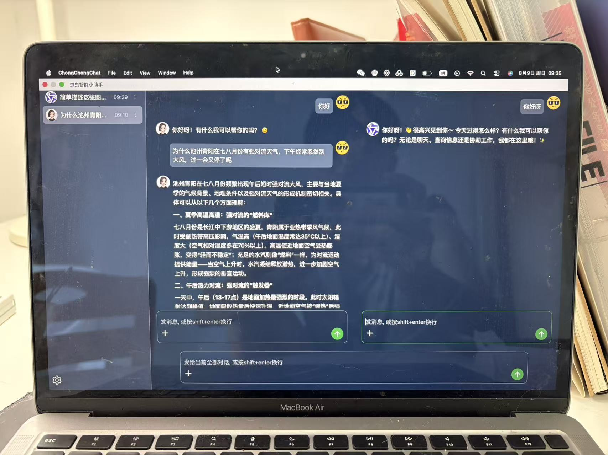

# Electron智能聊天桌面端软件 <Badge type="tip" text="done" />

## 项目背景与介绍
- 桌面端智能助理聊天软件，接入多个智能体可供选择，如智谱清言GLM, 阿里千问等

## 项目地址
- Github repo（代码）: https://github.com/15240021857/wx-electron-intel-chat
- Github release（软件包）: https://github.com/15240021857/wx-electron-intel-chat/releases

## 人员组成
- 项目负责人：独立个人

## 架构组成
- 用户终端：Electron + Vue3 + ts
## 项目截图
- AI对话功能，支持图片理解

- 用户比对功能, 支持多子对话框

## 核心数据流转

## 功能与特性

- 跨window/mac电脑系统, 下载即可使用智能聊天，为您答疑解惑，多种主流大模型可供选择。
- 支持智能体切换，用户可以根据需要选择不同的智能体。
- 支持多个对话聊天框横向对比（多个子对话窗口）
- 支持厂商模型自管理
- 支持多语言
- 支持浅色/暗色主题切换，支持自定义主题颜色
- 支持软件热更新 -doing

## 项目经验与难点亮点

### 具体实现

- 利用electron-forge快速搭建项目
- 技术选型：
  - 系统原生支持：electron
  - 页面驱动： Vue3+ts
  - 状态管理：pinia
  - 样式：tailwindcss
  - 代码质量与规范：eslint + prettier
  - 代码打包：electron-builder
  - 代码部署：github release
  - 软件热更新：electron-updater
