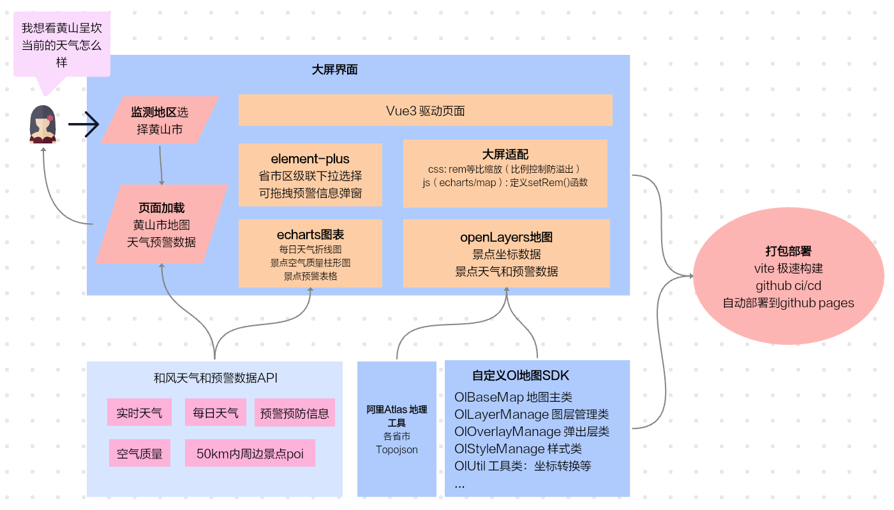
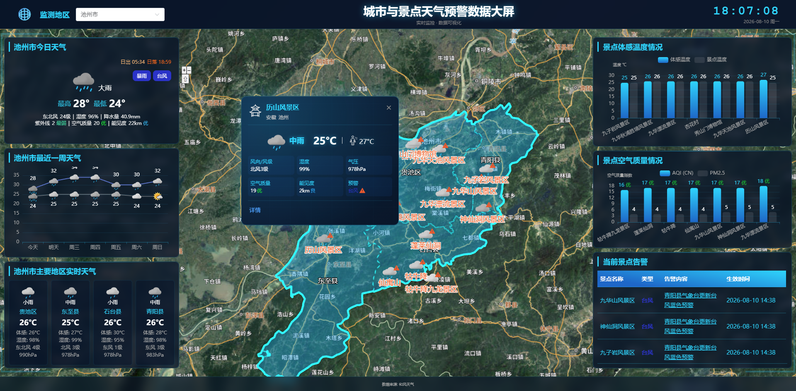
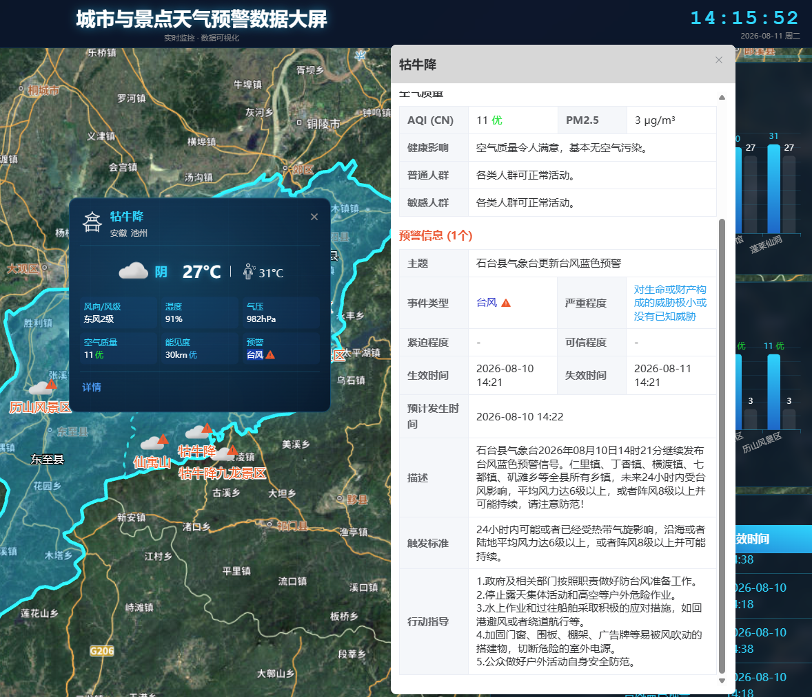
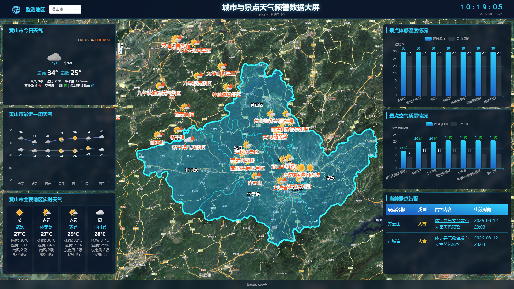

# Openlayers景点天气预警数据大屏 <Badge type="tip" text="done" />

## 项目背景与介绍
- 背景：现在天气预报大多是一个地区一个地区报，不能直观看到整体情况，也看不到具体景点的天气和预警情况。
- 介绍：这是一款基于基于openlayers地图的天气和预警大屏网站。您可以切换省内市区及其周边景点，支持查看省内外各个地区，各个景点的天气和预警和预防信息，直观明了。

## 项目地址
- Github repo（代码地址）: https://github.com/15240021857/wx-ol-journey-screen
- Github Pages（线上地址）: https://15240021857.github.io/wx-ol-journey-screen/

## 架构组成 & 数据流转

## 技术栈说明
- 前端：
    - Vue3 MVVM 数据驱动视图架构
    - ts 类型检查
    - ol openlayers 用于地图展示
    - pinia + localStorage 用于全局状态 + 数据缓存
    - vite 极速项目构建
    - eslint + prettier 代码规范
    - github ci/cd + github pages 自动部署
- 后端接口：和风天气 https://dev.qweather.com/docs/api/geoapi/
    - 实时天气，每日天气，预警预防信息，50km内周边景点poi，空气质量
    

## 项目截图
- 主地区与景点数据展示

- 预警弹窗

- 黄山市地区天气预警展示

## 科技感提升计划
- https://blog.csdn.net/2401_82881178/article/details/139430053
- 按钮流过效果：https://juejin.cn/post/6966482130020859912

