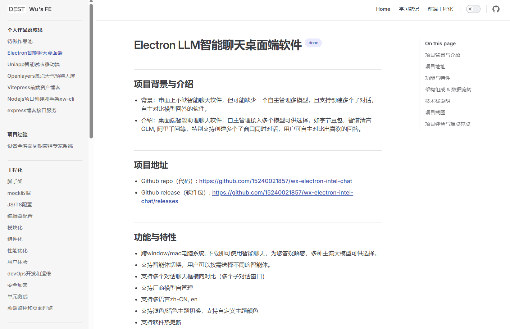

# Vitepress前端资产博客 <Badge type="warning" text="持续建设中" />

## 项目介绍 & 线上地址
- 前端经验总结集合
- Github repo（代码仓库）：https://github.com/15240021857/web-docs
- Github pages（静态页面部署）: https://15240021857.github.io/web-docs/

<!--  -->


## 功能与特性
- 自维护 & 持续更新
- 个人作品
- 项目经验【仅技术总结，不触碰任何企业保密内容！】
- 前端工程化
- 学习笔记
- 前端流程规范
- 架构设计
- 人工智能AI coding
- 其他事

## 为什么做个人博客

- 前端知识非常多，归纳知识，方便记忆
- 沉淀前端经验，提升武器库
- 爱好

## 项目截图
- 博客内容



## 个人博客网站搭建过程

- 通过 vitepress 作为文档主体
- github-pages 作为静态页面部署工具
- 用 github actions 作为ci/cd 工具，实现持续自动集成&部署。

### 具体实现

- 根据 VitePress 官方部署指南操作 https://vitepress.dev/zh/guide/deploy#platform-guides
### 难点
- 遇到坑了：
  - 1.deploy.yml 中 配置文件中的 pnpm 方式下的构建 会报没有指明 pnpm version 的错
    - 解决：需指明 pnpm version 即可
  - 2.deploy.yml 中 当前vitepress@1.3.4，打包后 dist 目录 path 是.vitepress/dist，而不是 docs/.vitepress/dist,需根据项目自行修改。

```yml
- name: pnpm set
  uses: pnpm/action-setup@v3 # 如果使用 pnpm，请取消注释
  with:
    version: 8
```
