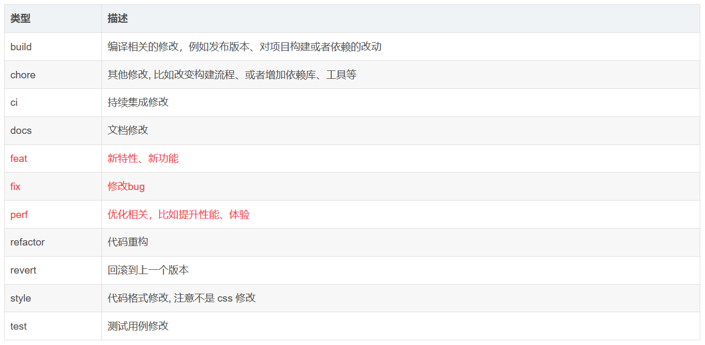

# git 规范 <Badge type="danger" text="will do" />

## 项目 git 分支管理

解决什么问题？

- 为了满足团队的合作共同开发一个项目，代码的合并等等
- 为了满足项目的开发、测试、部署流程
- 为了应对需求变更、生产环境热修、多版本并行等等灵活的开发、测试、部署流程

怎么做呢？

## 代码回滚

解决什么问题？

- 当 commit 了错误代码，想反悔？
- 当 push 了错误代码，想反悔？
- 当上线发布了错误 web 分支，想反悔？
  - 找运维哥哥回滚？

怎么做呢？

## git 代码提交规范 commitlint

是什么？

- 是一种信息规范，是 git 提交 commit 代码时的 message 的前缀，让人一目了然这次提交的类型。

解决什么问题？

- git 提交信息，大都三言两语描述，无法快速知道每次提交是干嘛的，你写了一个 "用户列表"，我怎么知道你是新增了用户列表模块，还是修改了，还是优化了列表性能？还是重构了列表呢？
- 那如果我写成以下方式，不是变得一目了然呢

  - feat: 用户列表，那就代表新增了用户列表
  - fix: 用户列表，代表修改了
  - perf: 用户列表， 代表优化了，性能或功能
  - docs: 用户列表，代表改了列表文档相关

- 参考：https://www.cnblogs.com/goloving/p/7197319.html

## 关联远程和本地仓库 --allow-unrelated-histories

- 当想把本地新项目代码提交到 git 仓库，
- 但是新建的仓库中有其他文件如.gitignore、README.md、Linsence 等时，两个仓库一开始无关联，无法直接通过 git pull, git push -u origin master.
- 此时根据 git 抛出的错误提示，可执行 git pull --allow-unrelated-histories 相关命令来进行合并或拉代码。

## 软件版本中的 Alpha,Beta,RC,Trial

- 参考：http://www.hdfz.cn/IT/ShowArticle.asp?ArticleID=404

### 开发阶段划分：

- α（Alpha）版：内测版，内部交流或者专业测试人员测试用。Bug 较多，普通用户最好不要安装。
- β（Beta）版：公测版，专业爱好者大规模测试用，存在一些缺陷，该版本也不适合一般用户安装。
- γ（Gamma）版：相当成熟的测试版，与即将发行的正式版相差无几。
- RC 版：是　 Release 　 Candidate 　的缩写，意思是发布倒计时，候选版本，处于 Gamma 阶段，该版本已经完成全部功能并清除大部分的 BUG。到了这个阶段只会除 BUG，不会对软件做任何大的更改。从 Alpha 到 Beta 再到 Gamma 是改进的先后关系，但 RC1、RC2 往往是取舍关系。
- Final：正式版。
