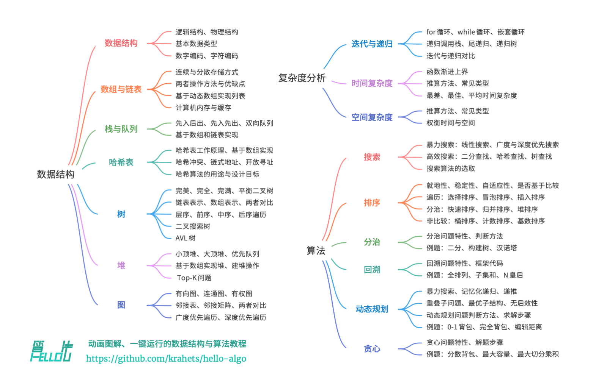

# 数据结构与算法

## 解决什么问题？

- 个人理解：用各种方法操作数据，让数据在某些维度达到最优，如时间维度、遍历次数等

参考资料：https://www.hello-algo.com/chapter_hello_algo/

## 组成

# 前端需关注的部分

## 时间复杂度

适应场景：

- vue diff
- js 遍历

## 冒泡算法

解决数组排序问题
思路：

- 从小到大排：相邻两两对比，若前>后,则调换位置，直到对比完成，即实现排序。

## 二分

## 常用运算

### 数组转树结构 dataToTree
